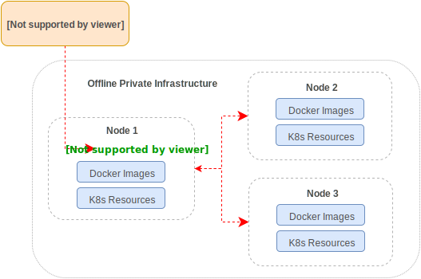

# Installation

### Ops Center-driven Installation

An Ops Center can be used for application deployments.
In order to deploy applications from an Ops Center, Application Bundles
are [published](pack.md#publishing-applications) to an Ops Center.
Once published, they become available for deployment.
An Application can be deployed either directly from an Ops Center or
via a one-time installation link.
Once the cluster is up and running, the installer will establish a remote access
channel for maintenance:


!!! tip "NOTE"
    The end users can close the remote channel and disconnect their Application
	from the Ops Center.


### Standalone Offline UI Installation

Standalone installation allows users to install into air-gapped (offline) server
clusters using a self-contained installer tarball.

 * The tarball can be generated on the Ops Center, by using the `Download` link.
 * Alternatively, the installer can be fetched from an Ops Center using `tele pull`,
see [Publishing Applications](pack.md#publishing-applications) section for details.
 * Installer tarball can be built with the `tele build` command, see
  [Packaging Applications](pack.md#packaging-applications) for details.

For example, Application Bundle, `my-app-installer.tar` will contain everything
required to install the Application `my-app`.

To install using the graphical wizard, a Linux desktop with a browser
is required and the target servers need to be reachable on port `3012`.
The node running wizard should have port `61009` reachable to other servers.

Unpacking the tarball will produce the following contents:

```bash
$ tar -xf my-app-installer.tar
$ ls -lh
-rwxr--r-- 1 user staff 21K  Oct 24 12:01 app.yaml
-rwxr--r-- 1 user staff 56M  Oct 24 12:01 gravity
-rwxr--r-- 1 user staff 256K Oct 24 12:01 gravity.db
-rwxr--r-- 1 user staff 679  Oct 24 12:01 install
-rwxr--r-- 1 user staff 170  Oct 24 12:01 packages
-rw-r--r-- 1 user staff 1.1K Oct 24 12:01 README
-rwxr--r-- 1 user staff 170  Oct 24 12:01 upgrade
-rwxr--r-- 1 user staff 170  Oct 24 12:01 upload
```

The installation wizard is launched by typing `./install` and will guide the end user
through the installation process.



### Standalone Offline CLI Installation

Instead of running a graphical installer, an Application Bundle can be installed
through a CLI which is useful for integrations with configuration management scripts
or other types of infrastructure automation tools. Sometimes this method is called
_"unattended installation"_.

For this to work, the information needed to complete the installation has to be
supplied via the command line flags to the installer.

Let's see how to install a 3-node cluster:

1. Copy the Application Bundle onto all nodes.
1. Execute `./gravity install` on the first node.
1. Execute `./gravity join` on two other nodes.

Below is a sample `./gravity install` command for the first node:

```bash
node-1$ sudo ./gravity install --advertise-addr=172.28.128.3 --token=XXX --flavor="three"
```

Note the use of `flavor` which, in this case, describes a configuration for 3 nodes
("three" being the name of the flavor from the [Application Manifest](pack.md#application-manifest)).

This will initiate the process of setting up a new cluster for the Application.

Below are corresponding `./gravity join` commands for the remaining nodes (`node-2` and `node-3`):

```bash
node-2$ sudo ./gravity join 172.28.128.3 --advertise-addr=172.28.128.4 --token=XXX --role="database"
```

```bash
node-3$ sudo ./gravity join 172.28.128.3 --advertise-addr=172.28.128.5 --token=XXX --role="worker"
```

This instructs the nodes to join a cluster initiated by `gravity install` on the node `172.28.128.3`.
Note, that nodes have also been assigned the desired roles (as defined in the Application Manifest).


The `install` command accepts the following arguments:

Flag      | Description
----------|-------------
`--token` | Secure token which prevents rogue nodes from joining the cluster during installation. Carefully pick a hard-to-guess value.
`--advertise-addr` | IP address this node should be visible as. This setting is needed to correctly configure Telekube on every node.
`--role` | _(Optional)_ Application role of the node.
`--cluster` | _(Optional)_ Name of the cluster. Auto-generated if not set.
`--cloud-provider` | _(Optional)_ Enable cloud provider integration: `generic` (no cloud provider integration), `aws` or `gce`. Autodetected if not set.
`--flavor` | _(Optional)_ Application flavor. See [Application Manifest](pack.md#application-manifest) for details.
`--config` | _(Optional)_ File with Kubernetes resources to create in the cluster during installation.
`--pod-network-cidr` | _(Optional)_ CIDR range Kubernetes will be allocating node subnets and pod IPs from. Must be a minimum of /16 so Kubernetes is able to allocate /24 to each node. Defaults to `10.244.0.0/16`.
`--service-cidr` | _(Optional)_ CIDR range Kubernetes will be allocating service IPs from. Defaults to `10.100.0.0/16`.
`--wizard` | _(Optional)_ Start the installation wizard.
`--state-dir` | _(Optional)_ Directory where all Telekube system data will be kept on this node. Defaults to `/var/lib/gravity`.
`--service-uid` | _(Optional)_ Service user ID (numeric). See [Service User](pack.md#service-user) for details. A user named `planet` is created automatically if unspecified.
`--service-gid` | _(Optional)_ Service group ID (numeric). See [Service User](pack.md#service-user) for details. A group named `planet` is created automatically if unspecified.
`--dns-zone` | _(Optional)_ Specify an upstream server for the given DNS zone within the cluster. Accepts `<zone>/<nameserver>` format where `<nameserver>` can be either `<ip>` or `<ip>:<port>`. Can be specified multiple times.

The `join` command accepts the following arguments:

Flag      | Description
----------|-------------
`--token` | Secure token which prevents rogue nodes from joining the cluster during installation. Carefully pick a hard-to-guess value.
`--advertise-addr` | IP address this node should be visible as. This setting is needed to correctly configure Telekube on every node.
`--role` | _(Optional)_ Application role of the node.
`--cloud-provider` | _(Optional)_ Cloud provider integration, `generic` or `aws`. Autodetected if not set.
`--mounts` | _(Optional)_ Comma-separated list of mount points as <name>:<path>.
`--state-dir` | _(Optional)_ Directory where all Telekube system data will be kept on this node. Defaults to `/var/lib/gravity`.
`--service-uid` | _(Optional)_ Service user ID (numeric). See [Service User](pack.md#service-user) for details. A user named `planet` is created automatically if unspecified.
`--service-gid` | _(Optional)_ Service group ID (numeric). See [Service User](pack.md#service-user) for details. A group named `planet` is created automatically if unspecified.


!!! tip "NOTE"
    `--advertise-addr` must also be set for every node, and the same value for `--token` must be used.

!!! tip "NOTE"
    With no `role` specified, the installer uses the first role defined in the Application Manifest.

The result of running these commands will be a functional and self-contained
Kubernetes cluster!

You can learn more in the [Packaging and Deployment](pack.md) section of the
documentation.


### Troubleshooting Installs

The installation process is implemented as a state machine split into multiple steps (phases).
Every time a step fails, the install pauses and allows one to inspect and correct the cause of the failure.

If the installation has failed, the installer will print a warning and pause:

```bash
root$ ./gravity install
Tue Apr 10 13:44:07 UTC	Starting installer
Tue Apr 10 13:44:09 UTC	Preparing for installation
Tue Apr 10 13:44:32 UTC	Installing application my-app:1.0.0-rc.1
Tue Apr 10 13:44:32 UTC	Starting non-interactive install
Tue Apr 10 13:44:32 UTC	Bootstrapping local state
Tue Apr 10 13:44:33 UTC	All agents have connected!
Tue Apr 10 13:44:33 UTC	Starting the installation
Tue Apr 10 13:44:34 UTC	Operation has been created
Tue Apr 10 13:44:35 UTC	Execute preflight checks
Tue Apr 10 13:44:37 UTC	Operation has failed
Tue Apr 10 13:44:37 UTC	Installation failed in 4.985481556s, check ./telekube-install.log
---
Installer process will keep running so you can inspect the operation plan using
`gravity plan` command, see what failed and continue plan execution manually
using `gravity install --phase=<phase-id>` command after fixing the problem.
Once no longer needed, this process can be shutdown using Ctrl-C.
```

To inspect installer's progress, use the `plan` command:

```bash
root$ ./gravity plan
Phase                  Description                                                               State         Requires                  Updated
-----                  -----------                                                               -----         --------                  -------
⚠ checks               Execute preflight checks                                                  Failed        -                         Tue Apr 10 13:44 UTC
* configure            Configure packages for all nodes                                          Unstarted     -                         -
* bootstrap            Bootstrap all nodes                                                       Unstarted     -                         -
  * node-1             Bootstrap master node node-1                                              Unstarted     -                         -
* pull                 Pull configured packages                                                  Unstarted     /configure,/bootstrap     -
  * node-1             Pull packages on master node node-1                                       Unstarted     /configure,/bootstrap     -
* masters              Install system software on master nodes                                   Unstarted     /pull                     -
  * node-1             Install system software on master node node-1                             Unstarted     /pull/node-1
...

Phase Execute preflight checks (/checks) failed.
Error:
server("node-1", 192.168.121.23) failed checks:
	⚠ fs.may_detach_mounts should be set to 1 or pods may get stuck in the Terminating state, see https://gravitational.com/gravity/docs/ver/4.x/faq/#kubernetes-pods-stuck-in-terminating-state
```

After fixing the error (i.e. enabling the kernel parameter in this example), resume the installation:

```bash
root$ sysctl -w fs.may_detach_mounts=1
root$ ./gravity install --resume
Tue Apr 10 13:55:26 UTC	Executing "/checks" locally
Tue Apr 10 13:55:26 UTC	Running pre-flight checks
Tue Apr 10 13:55:28 UTC	Executing "/configure" locally
Tue Apr 10 13:55:28 UTC	Configuring cluster packages
Tue Apr 10 13:55:32 UTC	Executing "/bootstrap/node-1" locally
Tue Apr 10 13:55:32 UTC	Configuring system directories
Tue Apr 10 13:55:35 UTC	Configuring application-specific volumes
Tue Apr 10 13:55:36 UTC	Executing "/pull/node-1" locally
Tue Apr 10 13:55:36 UTC	Pulling user application
Tue Apr 10 13:55:46 UTC	Still pulling user application (10 seconds elapsed)
...
Tue Apr 10 14:01:07 UTC	Executing "/app/my-app" locally
Tue Apr 10 14:01:08 UTC	Executing "/election" locally
Tue Apr 10 14:01:08 UTC	Enable leader elections
Tue Apr 10 14:01:09 UTC	Executing install phase "/" finished in 5 minutes

```

The following CLI flags are useful to manage the install operation:


Flag      | Description
----------|-------------
`--phase` | Specifies the name of the step to execute. Use `gravity plan` to display the list of all steps.
`--force` | Force execution of the step even it is already in-progress.
`--resume` | Resume operation after the failure. The operation is resumed from the step that failed last.
`--manual` | Launch operation in manual mode.


## AWS Installer

A standalone installer can be used to create a new AWS cluster from a deployable
tarball using automatic provisioner. It works by uploading the installer tarball
on a AWS EC2 instance and executing the `gravity install` command.

### Restrictions & Requirements

This install flow is subject to a few restrictions and requirements.

* The installer must be launched from a EC2 instance.
* The EC2 instance that runs the installer will not be part of the cluster.
* The EC2 instance that runs the installer must have a public IP attached, or
be otherwise reachable by the nodes of the cluster that is being installed.
* The EC2 instance that runs the installer must have ports `32009` and `3024`
open to the nodes of the cluster that is being installed.
* The EC2 instance that runs the installer must be able to accommodate a
single-node Telekube cluster of its own so all requirements and recommendations
from [System Requirements](requirements.md/) apply to it.

### AWS Credentials & IAM Policy

In addition to the requirements listed above, the machine running the installer
should have proper AWS credentials. The credentials can be configured by creating
a AWS credentials file as described in [Configuring the AWS CLI](https://docs.aws.amazon.com/cli/latest/userguide/cli-chap-getting-started.html).
If credentials are not found, the installer will attempt to retrieve the
instance's IAM credentials using AWS metadata API. In this case the instance
should have a proper IAM policy assigned to it.

<details><summary>Click here to view an example IAM policy.</summary>
```
{
    "Version": "2012-10-17",
    "Statement": [
        {
            "Effect": "Allow",
            "Action": [
                "autoscaling:*",
                "ec2:*",
                "elasticloadbalancing:*",
                "iam:AddRoleToInstanceProfile",
                "iam:CreateInstanceProfile",
                "iam:CreateRole",
                "iam:DeleteInstanceProfile",
                "iam:DeleteRole",
                "iam:DeleteRolePolicy",
                "iam:GetInstanceProfile",
                "iam:GetRole",
                "iam:GetRolePolicy",
                "iam:ListInstanceProfiles",
                "iam:ListInstanceProfilesForRole",
                "iam:ListRoles",
                "iam:PassRole",
                "iam:PutRolePolicy",
                "iam:RemoveRoleFromInstanceProfile",
                "kms:DescribeKey",
                "kms:ListAliases",
                "kms:ListKeys",
                "s3:*",
                "sqs:ChangeMessageVisibility",
                "sqs:ChangeMessageVisibilityBatch",
                "sqs:CreateQueue",
                "sqs:DeleteMessage",
                "sqs:DeleteMessageBatch",
                "sqs:DeleteQueue",
                "sqs:GetQueueAttributes",
                "sqs:GetQueueUrl",
                "sqs:ListDeadLetterSourceQueues",
                "sqs:ListQueueTags",
                "sqs:ListQueues",
                "sqs:PurgeQueue",
                "sqs:ReceiveMessage",
                "sqs:SendMessage",
                "sqs:SendMessageBatch",
                "sqs:SetQueueAttributes",
                "sqs:TagQueue",
                "sqs:UntagQueue",
                "ssm:DeleteParameter",
                "ssm:DeleteParameters",
                "ssm:DescribeParameters",
                "ssm:GetParameter",
                "ssm:GetParameters",
                "ssm:ListTagsForResource",
                "ssm:PutParameter"
            ],
            "Resource": "*"
        }
    ]
}
```
</details>

!!! note
    The exact list of required permissions may depend on the provisioner you're
    using. The IAM policy shown above is an example for
    [gravitational/provisioner](https://github.com/gravitational/provisioner).

### Installation

Once you have an instance that satisfies the above requirements, it can be
used to install clusters on AWS using the flow described below.

* Build the application installer, e.g. using [tele build](pack.md#packaging-applications).

!!! note
    Note that the application must include provisioning hooks as described
    in [Customized Cluster Provisioning](manage.md#customized-cluster-provisioning).
    See [gravitational/provisioner](https://github.com/gravitational/provisioner)
    repository on Github for an example of a Terraform-based provisioner.

* Transfer the installer to the EC2 instance and unpack.
* Create a cluster resource spec to describe the desired cluster profile:

```yaml
# cluster.yaml
kind: cluster
version: v2
metadata:
  # cluster name
  name: example.com
spec:
  # cloud provider, must be "aws"
  provider: aws
  aws:
    # AWS region to install to
    region: us-east-2
    # AWS key pair name to use
    keyName: ops
    # (optional) AWS VPC to install to
    vpc: ""
  # nodes to provision
  nodes:
    # profile names must match those from the app manifest
    - profile: node
      count: 1
      instanceType: m4.xlarge
  # (optional) additional Kubernetes resources to create in cluster
  resources: |
    ...
  # (optional) license string if the app requires it
  license: |
    ...
```

* Launch installation by running the following command from the installer
tarball:

```bash
$ sudo ./gravity install --cluster-spec=cluster.yaml
```

Keep in mind that, as was mentioned in the requirements section above, by
default the provisioned nodes will be connecting to the installer instance
using its public IP which will be determined automatically by querying AWS
metadata API. To override this behavior, you can explicitly set the advertise
address using `--ops-advertise-addr` flag. Note that the port in the provided
address must be `32009`.

```bash
$ sudo ./gravity install --cluster-spec=cluster.yaml --ops-advertise-addr=172.31.41.70:32009
```

## Installing on Google Compute Engine

!!! note 
    GCE cloud provider integration is supported starting from Telekube
    version `5.1.0-alpha.1`.

Before installation make sure that GCE instances used for installation
satisfy all of Telekube [system requirements](requirements.md). In addition to these
generic requirements GCE nodes also must be configured in the following way to
ensure proper cloud provider integration:

* Network interface must have IP forwarding turned on. It is required for the
overlay network to work properly.
* Instances must be assigned a [network tag](https://cloud.google.com/vpc/docs/add-remove-network-tags)
matching the name of the cluster. It is required to ensure that created load
balancers discover proper instances.
* Cloud API access scopes must include RW permissions for Compute Engine.

Once the nodes have been properly configured, copy the installer tarball and
launch installation as described above:

```bash
node1$ sudo ./gravity install --advertise-addr=<addr> --token=<token> --cluster=<cluster> --cloud-provider=gce
node2$ sudo ./gravity join <installer-addr> --advertise-addr=<addr> --token=<token> --cloud-provider=gce
```

Note that the `--cloud-provider` flag is optional and, if unspecified, will be
auto-detected if install/join process is running on a GCE instance.
