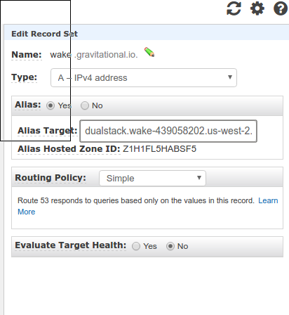
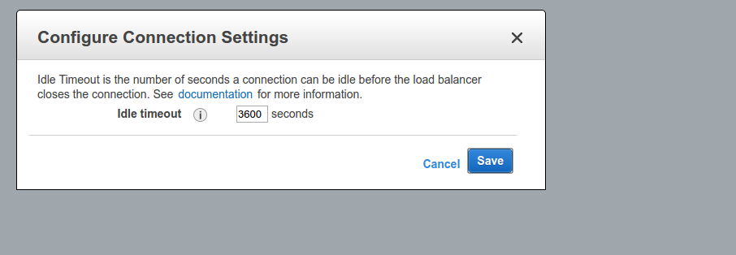
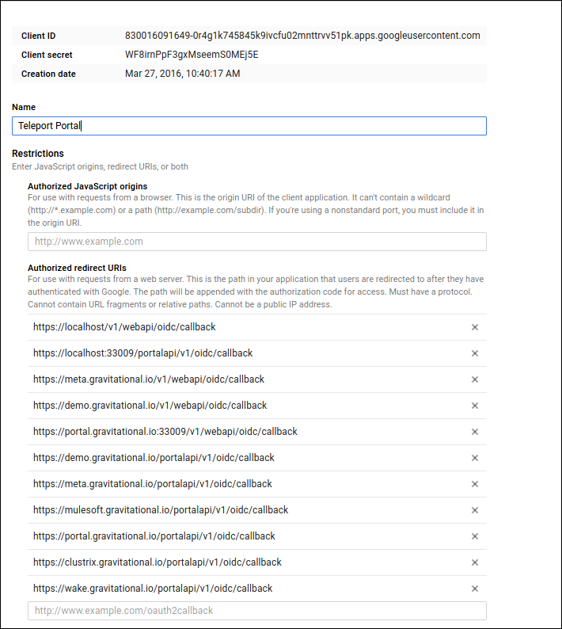

# Provisioning new Gravity Ops Center on AWS

## Set up AWS infrastructure

### Create instance

Choose a debian image from community images:


Make sure you use `ops` keypair so we can all get access by default.
The keypair key is in LastPass ("Ops PEM Key")


Configure right security groups:


Create elastic LB:





Create largish volume with guaranteed IOPS and attach it to the instance:


Create DNS entry and set it up to the elastic IP


### Manual prep

If everything is OK, you should be able to log in:

ssh -i ~/.ssh/ops.pem admin@<instance-ip>


Now create file system on the attached volume, in my case it is `/dev/xvdf`:

```bsh
admin@ip-172-31-16-134:~$ sudo fdisk -l

Disk /dev/xvda: 8 GiB, 8589934592 bytes, 16777216 sectors
Units: sectors of 1 * 512 = 512 bytes
Sector size (logical/physical): 512 bytes / 512 bytes
I/O size (minimum/optimal): 512 bytes / 512 bytes
Disklabel type: dos
Disk identifier: 0xd7f2e0e8

Device     Boot Start      End  Sectors Size Id Type
/dev/xvda1 *     4096 16773119 16769024   8G 83 Linux

Disk /dev/xvdf: 100 GiB, 107374182400 bytes, 209715200 sectors
Units: sectors of 1 * 512 = 512 bytes
Sector size (logical/physical): 512 bytes / 512 bytes
I/O size (minimum/optimal): 512 bytes / 512 bytes
```

```bsh
sudo mkfs.ext4 /dev/xvdf
```

Add auto mount point:

```bsh
sudo su
echo -e "[Mount]\nWhat = /dev/xvdf\nWhere = /var/lib/gravity\nType = ext4\n[Install]\nWantedBy = multi-user.target" > /etc/systemd/system/var-lib-gravity.mount
systemctl enable var-lib-gravity.mount
```

Change the default listening port on sshd:

```bsh
sudo emacs -nw /etc/ssh/sshd_config
```

```bsh
Port 61822
```

Reboot to make sure everything is cool


## Automatic Provisioning


* Create new inventory [wake.gravitaional.io](../deploy/wake.gravitational.io)
* Clone `ops` repository in your $GOPATH:

```bsh
mkdir -p $GOPATH/src/github.com/gravitational
cd $GOPATH/src/github.com/gravitational
git clone git@github.com:gravitational/ops.git
```

* Launch provisioning script:

You will be asked to enter GPG password to decrypt secrets in github.
The password to decrypt GPG keys is in LastPass ("GPG Provisioning Key)", so get it before launching provisioning script.

```bsh
cd $GOPATH/src/github.com/gravitational/gravity/deploy
KEY=--private-key=~/.ssh/ops.pem INVENTORY=wake.gravitational.io make provision
```


### Set Up OIDC

Open:

https://console.developers.google.com/apis/credentials?project=teleport-1263&authuser=1

Add a new OIDC hook for the new Ops Center




### Deploy

Now you can use parameterized builds in jenkins to deploy to your inventory:


