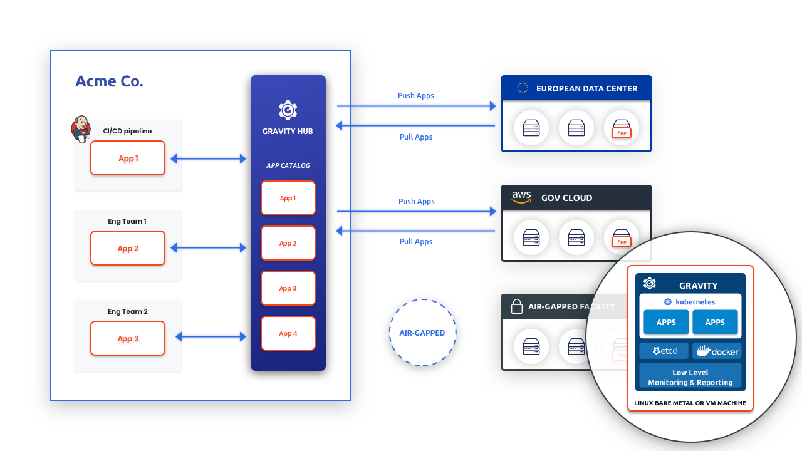

# Introduction

Gravity is an open source toolkit that provides true portability for cloud-native applications. 
It allows developers to package a Kubernetes cluster and all its applications into a single
file called a "Cluster Image".

Each Cluster Image is a dependency-free `.tar` file. It can be deployed into a variety of
target infrastructure options, such as developers' own cloud infrastructure, 3rd party 
cloud accounts, bare metal servers, VMware environments or even into air-gapped servers 
not connected to the Internet.

The Cluster Image can be installed across multiple Linux machines through a web browser 
GUI or CLI installation wizard to create a resilient Kubernetes cluster. This process 
is completely autonomous and does not require any dependencies from outside the Cluster Image. 

When a Cluster is up and running, Gravity eases the operational burden of managing it. 
Each Cluster includes the `gravity` daemon that acts as a "Kubernetes hypervisor",
continuously monitoring the health of Kubernetes services and re-configuring them, 
if necessary. In addition, each Gravity Cluster contains an authentication gateway 
which allows ops teams to remotely troubleshoot and push updates to many instances
of the same appliance either via SSH or Kubernetes API, even if they are located
behind a firewall.

The Gravity Community Edition is open sourced [on Github](https://github.com/gravitational/gravity) 
if you want to dive into the code. This documentation is also available in the Github repository, 
so feel free to create an issue or pull request if you have comments.

This overview will walk you through the basic concepts of Gravity and explain
how it is used to solve the operational challenges that typically arise when
running many Kubernetes clusters across distributed teams within a large organization,
or across multiple organizations.

## Use Cases

There are two primary use cases for Gravity:

1. **Delivering Kubernetes applications to third-party premises:** SaaS vendors 
that are selling to highly regulated industries or government entities may need 
to deploy and remotely update complex cloud applications in private data 
centers or public cloud accounts owned by their customers (aka, on-prem). Gravity reduces the time and operational overhead of delivering these applications on-prem.

2. **Internal multi-cluster Kubernetes deployments:** Teams of site reliability
engineers (SREs) are often tasked with providing Kubernetes-as-a-Service within 
their organization across multiple cloud providers or hybrid environments. The
image-based approach allows them to treat Kubernetes clusters as cattle, not pets, 
dramatically reducing the operational overhead.

In either use case, Gravity users can create a Cluster Image that contains:

- The Kubernetes binaries and their dependencies;
- Application containers and their layers;
- A private Docker registry for autonomous operation;
- A monitoring and alerting system; and
- An authentication gateway for remotely managing the Gravity Cluster via both SSH 
and the Kubernetes API.

In other words, a Gravity Cluster Image is a _self-contained, downloadable
Kubernetes appliance_ which enables true portability for cloud applications across 
any public or private infrastructure.



## Documentation Overview

A brief explanation of each section of this documentation is below:

- [Quickstart Guide](quickstart.md) - A quick tutorial to show off the basic capabilities of Gravity. A good place to start if you want to jump right in.
- [Building Cluster Images](pack.md) - How to build a Gravity Cluster Image from scratch.
- [Installation](installation.md) - How to install a Gravity Cluster Image in a target environment.
- [Cluster Configuration](config.md) - How to configure your Gravity Cluster.
- [Cluster Management](cluster.md) - Everything you need to know for operating Gravity Clusters.
- [Cluster Monitoring](monitoring.md) - Overview of the monitoring and alerting tools that Gravity uses.
- [Cluster Access](access.md) - How Gravity users Teleport to manage access to
Clusters.
- [Gravity Hub](hub.md) - Setting up and using Gravity Hub (Enterprise edition only).
- [CLI Reference](cli.md) - Overview of the Gravity CLI tools.
- [System Requirements](requirements.md) - System requirements to successfully run Gravity components.
- [Releases](changelog.md) - List of Gravity versions and release notes.
- [FAQ](faq.md) - Common issues encountered in Cluster environments.
- [Guides](guides.md) - A list of other Gravity related workshops and guides we have published.
- [Terraform](terraform.md) - Guide for using Terraform with Gravity.


## Components

Gravity consists of the following components:

| Component   | Description
|-------------|---------------------------------------------------------------------------------------------------------------------------------------------------------|
| `tele`      | The build tool. `tele` is used for building Cluster Images. The enterprise edition of `tele` can also publish Cluster Images into Gravity Hub.  |
| `tsh`       | The remote access client to authenticate against a SAML/OAuth identity provider and remotely connect to Kubernetes clusters via SSH or Kubernetes API.   |
| `gravity`(service) | The Cluster managerement service which runs on every node. It reduces the complexities of Kubernetes management.
| `gravity`(CLI)| The CLI tool to perform high level Cluster administration tasks like expansion, upgrades, etc.  |
| Control Panel | A web application available for the monitoring and management of individual Clusters. |
| Gravity Hub | Gravity Hub is a web portal and repository for publishing Cluster Images and monitoring and remotely accessing multiple Clusters. Think of Gravity Hub as a catalog of Kubernetes clusters and Kubernetes applications. Gravity Hub is only available in the Gravity Enterprise edition. |

## Cluster Lifecycle

A Cluster Image may contain an "empty" Kubernetes environment or contain multiple Kubernetes applications. The typical life cycle of such applications consists of
the following:

0. First, you must prepare your application(s) to run on Kubernetes. If you do
   not have Kubernetes expertise, our Solutions Engineering Team can help.
1. Package the applications into a Cluster Image using the `tele` CLI tool.
2. Publish the Cluster Image for distribution. AWS S3 or any CDN can be used
   to publish downloadable images. Gravity Enterprise users can also use Gravity Hub to manage the publishing and distribution of Cluster Images.
3. Deploy and install the Cluster Image onto any supported Linux-based
   infrastructure ("Gravity Cluster" or "Cluster").
4. Securely connect to any Cluster to monitor health, provide automatic
   updates, remote support, etc.

## Packaging

To create a Cluster Image:

* Create Kubernetes resources describing your application(s). You can use "raw"
  Kubernetes resources as YAML files or [Helm charts](https://helm.sh/) are
  also supported.
* Provide a Cluster Image Manifest described below. The manifest is used to customize
  the Cluster Image.
* Place all of these files in the same directory and execute `tele build`

A Cluster Image manifest is required to describe hardware/system requirements of your
Cluster and to customize the process of creating a new Cluster instance.

!!! tip "Gravity Roadmap Tip"
    The Kubernetes community is working on finalizing their cluster API spec. Once it
    becomes production ready, we will likely adopt the
    future standard to replace the Cluster Image manifest. 

Below is a sample image manifest in YAML format. It follows the Kubernetes
configuration conventions:

```yaml
# this is an example of a small image manifest
apiVersion: cluster.gravitational.io/v2
kind: Cluster
metadata:
  name: "Example"
  resourceVersion: "1.0.0"

installer:
# a Cluster Image may optionally include the system requirements. this allows
# the publisher of an image to restrict its usage only to infrastructure with
# a defined performance envelope
nodeProfiles:
  - name: node
    description: "worker node"
    requirements:
      cpu:
        min: 1
      ram:
        min: "2GB"
```

The image manifest works in conjunction with [Helm charts](https://helm.sh/)
and Kubernetes resources like jobs and configuration maps. These tools provide
a high degree of flexibility for specifying how applications are installed,
updated and configured.

To create a Cluster Image you have to:

1. Place the required Kubernetes resources, Helm charts and the Cluster Image Manifest in the same directory.
2. Execute the `tele build` command to create the Cluster Image:

```bsh
$ tele build -o cluster-image.tar manifest.yaml
```

This will produce the Cluster Image called `cluster-image.tar`, which can be
deployed across any cloud providers and private data centers.

You can learn more about the image manifest in the [Building Cluster Images](pack.md)
section of the documentation.

## Publishing

Publishing can be as simple as uploading the Cluster Image to an S3 bucket or CDN for
others to download and install.

Another option is to publish the Cluster Image into Gravity Hub, a
centralized repository of Cluster Images. If a Cluster Image is distributed via
Gravity Hub, the resulting Gravity Cluster can optionally "dial home" for automatic
updates, remote monitoring and troubleshooting.

Gravity Hub allows Cluster Image publishers to oversee how many clusters
are running and perform administration and maintenance across all of them in a
repeatable, scalable way, even if they are deployed on 3rd party
infrastructure.

!!! warning "Enterprise Only Version Warning"
    The Gravity Hub is only available to the users of Gravity Enterprise.

## Deploying and Installing

Creating new clusters from a Cluster Image is trivial:

1. Place a Cluster Image on a Linux node and unpack ("untar") it.
2. Launch the included installer.

For more details about the installation process, please refer to [Installation Guide](installation.md).

## Cluster Management

Once a Cluster Image is installed, it becomes a fully operational and
autonomous Gravity Cluster.

For managing a running Gravity Cluster, the Cluster Control Panel or the `gravity` 
tool can be used. 

The `gravity` daemon runs on every Cluster node as a "Kubernetes hypervisor", continuously monitoring the health of Kubernetes services and re-configuring them if necessary. For example, it provides automatic management of `etcd`.

`gravity` also functions as a command line (CLI) tool to perform Cluster administration tasks such as:

1. Adding or removing nodes to a Cluster.
2. Performing in-place upgrades of Kubernetes or any of the applications running inside.
3. Printing Cluster status.

When it comes to cluster management, `gravity` is a higher level replacement
for tools like `kubeadm` or `etcdadm`.  It delivers benefits such as enforcing
system requirements and delivering on the promise of lower operational overhead
by automating away many mundane Kubernetes tasks.

You can still use `kubectl` for tasks like watching logs, seeing stats for pods
or volumes, managing configuration and other operational tasks.

For more details on using `gravity` to manage Clusters please see the [Cluster Management](cluster.md) section.

