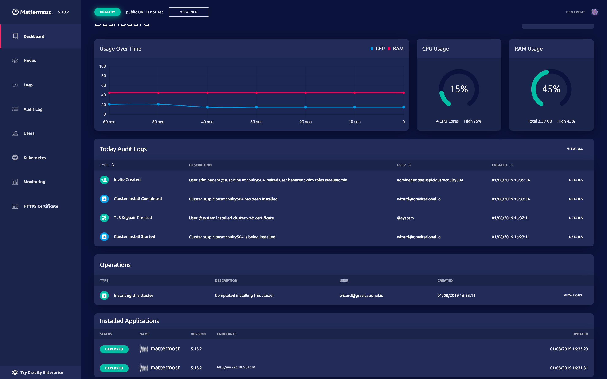

# Cluster Management

Every Cluster created from a Gravity Cluster Image is a fully featured
Kubernetes environment. It contains the following components:

1. All user applications that have been packaged into the Cluster Image.
2. All Kubernetes daemons like `kube-scheduler`, `kube-apiserver`, and others.
3. The Kubernetes CLI tool: `kubectl`.
4. The Gravity Cluster "hypervisor", called `gravity`, for managing the Cluster.
5. A web application to monitor and manage the Cluster state ("Control
Panel")
6. The Gravity Authentication Gateway for integrating Kubernetes authentication
   and SSH access to Cluster nodes with corporate identity providers via SSO.

You can also use familiar Kubernetes tools such as `kubectl` to perform regular
Cluster tasks such as watching logs, seeing stats for pods or volumes or
managing configurations.

**Example Control Panel**


## Kubernetes Environment

A Gravity Cluster is a highly available (HA) instance of Kubernetes running on
multiple nodes, so the standard Kubernetes tools will work and Kubernetes rules
will apply.

However, Gravity pre-configures Kubernetes to be as reliable as possible,
greatly reducing the need for ongoing active management. To make this possible,
the `gravity` hypervisor launches and manages all Kubernetes Linux daemons.

When the `gravity` daemon starts, it creates its own "Master Container". The
Master Container itself is a containerized `systemd` instance. It launches the required Kubernetes daemons and contains their dependencies as well as monitoring and support tools.

Running Kubernetes services from inside the Master Container brings several
advantages as opposed to installing Kubernetes components in a more traditional
way:

* Since all Kubernetes services such as `kubelet` or `kube-apiserver` always
  run enclosed inside the Master Container, it makes it possible for Gravity
  to closely monitor the Cluster health and perform Cluster upgrades.

* `gravity` _continuously_ maintains Kubernetes configuration to be highly
  available ("HA").  This means that any node can go down without disrupting
  Kubernetes' operation.

* `gravity` runs its own local Docker registry which is used as a Cluster-level
  cache for container images. This makes application upgrades and restarts
  faster and more reliable. See [Interacting with Cluster Registry](#interacting-with-cluster-registry)
  for details.

* `gravity` provides the ability to perform Cluster state snapshots as part of
  Cluster upgrades or to be used independently.

### Kubernetes Extensions

Gravitational also offers various extensions for Kubernetes that can be
pre-packaged and distributed with your application. Examples of such solutions
include:

* Master-slave controllers for popular open source databases.
* On-site emulators of popular AWS APIs such as S3 or SQS.
* Intra-Cluster network encryption.
* Application monitoring and integrations with 3rd party data collection
  facilities such as Splunk.
* Identity management for integrating Cluster access into existing identity
  providers.

!!! tip "Note"
	The list above is not complete. Gravitational Solutions Engineering offers a
	wide variety of Kubernetes integration and migration services. Reach out to
	`info@gravitational.com` if you have questions.

## Gravity CLI Tool

`gravity` is the CLI command available on every Cluster node. Use it to perform
high level Cluster administration tasks such as adding or removing nodes,
upgrading, etc.

The `gravity` commands allows you to:

1. Quickly add new nodes to a Cluster.
2. Remove nodes from a Cluster.
3. Monitor Gravity Cluster health.
4. Update / backup / restore the Gravity Cluster.
5. Request shell inside the Master Container to troubleshoot Kubernetes health on a node level.

Below is the full list of `gravity` commands:

| Command   | Description                                                                  |
|-----------|------------------------------------------------------------------------------|
| `gravity status`    | Show the status of the Cluster and the application running in it   |
| `gravity update`    | Manage application updates on a Gravity Cluster                    |
| `gravity upgrade`   | Manage the Cluster upgrade operation for a Gravity Cluster         |
| `gravity plan`      | Manage operation plan                                              |
| `gravity join`      | Add a new node to the Cluster                                      |
| `gravity autojoin`  | Join the Cluster using cloud provider for discovery                |
| `gravity leave`     | Decommission a node: execute on a node being decommissioned        |
| `gravity remove`    | Remove the specified node from the Cluster                         |
| `gravity backup`    | Perform a backup of the application data in a Cluster              |
| `gravity restore`   | Restore the application data from a backup                         |
| `gravity tunnel`    | Manage the SSH tunnel used for the remote assistance               |
| `gravity report`    | Collect Cluster diagnostics into an archive                        |
| `gravity resource`  | Manage Cluster resources                                           |
| `gravity exec`      | Execute commands in the Master Container                           |
| `gravity shell`     | Launch an interactive shell in the Master Container                |
| `gravity gc`        | Clean up unused Cluster resources                                  |


## Cluster Status

Running `gravity status` will give you the high level overview of the Cluster health,
as well as the status of its individual components.

Here's an example of how to remotely log in to a Cluster via `tsh` and check the
status of the Cluster named "production":

```bsh
$ tsh --cluster=production ssh admin@node gravity status
```

### Cluster Health Endpoint

Clusters expose an HTTP endpoint that provides system health information about
Cluster nodes. Run the following command from one of the Cluster nodes to query
the status:

```bsh
$ curl -sk https://localhost:7575 | python -m json.tool
{
    "nodes": [
        {
            "member_status": {
                "addr": "192.168.121.245:7496",
                "name": "192_168_121_245.example",
                "status": "alive",
                "tags": {
                    "publicip": "192.168.121.245",
                    "role": "master"
                }
            },
            "name": "192_168_121_245.example",
            "probes": [
                {
                    "checker": "kube-apiserver",
                    "status": "running"
                },
                {
                    "checker": "docker",
                    "status": "running"
                },
                ...
                {
                    "checker": "etcd-healthz",
                    "status": "running"
                }
            ],
            "status": "running"
        }
    ],
    "status": "running"
}
```

This command displays the health status of each Cluster node and the overall
Cluster health. In a healthy Cluster the status of all health probes, individual
nodes and the Cluster overall is `running`, and the response HTTP status code
is `200 OK`.

If a node fails any of its health probes, the output reflects this by moving
the failed probe status to `failed` and the node and the Cluster status to
`degraded`. For example, here is what the output would look like if a Docker
process crashed on a node:

```bsh
$ curl -sk https://localhost:7575 | python -m json.tool
{
    "nodes": [
        {
            "member_status": {
                "addr": "192.168.121.245:7496",
                "name": "192_168_121_245.example",
                "status": "alive",
                "tags": {
                    "publicip": "192.168.121.245",
                    "role": "master"
                }
            },
            "name": "192_168_121_245.example",
            "probes": [
                {
                    "checker": "docker",
                    "error": "healthz check failed: Get http://docker/version: dial unix /var/run/docker.sock: connect: no such file or directory",
                    "status": "failed"
                },
                {
                    "checker": "kube-apiserver",
                    "status": "running"
                },
                ...
            ],
            "status": "degraded"
        }
    ],
    "status": "degraded"
}
```

In this case the response HTTP status code will be `503 Service Unavailable`.

### Cluster Status History

Running `gravity status history` displays the history of changes to the
Cluster status.

Example output may look something like the following:

```bsh
$ gravity status history
2020-02-18T01:36:07Z [Node Degraded]     node=node-1
2020-02-18T21:36:11Z [Node Degraded]     node=node-2
2020-02-18T21:36:25Z [Node Degraded]     node=node-3
2020-02-18T21:36:56Z [Probe Succeeded]   node=node-1 checker=node-status
2020-02-18T21:36:58Z [Probe Succeeded]   node=node-2 checker=node-status
2020-02-18T21:36:58Z [Probe Succeeded]   node=node-2 checker=time-drift
2020-02-18T21:36:59Z [Probe Succeeded]   node=node-3 checker=node-status
2020-02-18T21:37:07Z [Probe Succeeded]   node=node-1 checker=kube-apiserver
2020-02-18T21:37:07Z [Node Recovered]    node=node-1
2020-02-18T21:37:08Z [Probe Succeeded]   node=node-2 checker=kube-apiserver
2020-02-18T21:37:08Z [Node Recovered]    node=node-2
2020-02-18T21:37:11Z [Probe Succeeded]   node=node-3 checker=kube-apiserver
2020-02-18T21:37:11Z [Node Recovered]    node=node-3
```

Here's an example of how to view the history remotely via `tsh`:

```bsh
$ tsh --cluster=production ssh admin@node gravity status history
```

The `gravity status history` command is an additional tool to help debug issues
with a Cluster. The `gravity status` command only displays the current status
and provides limited visibility into the state of the Cluster. The
`gravity status history` command is there to help fill in the gaps. The history
lets you observe when and where problems have occurred within the Cluster.

There are just a few event types that are currently being tracked.
- `Node Degraded` / `Node Recovered` specifies a change in the node status. The node
key specifies the name of the node (node-1, node-2, node-3).
- `Probe Succeeded` / `Probe Failed` specifies a change in a probe result. The checker
key specifies the name of the health check (time-drift, kube-apiserver).

The `gravity status history` command is available on all `master` nodes of the
cluster and provides an eventually consistent history between nodes.

## Application Status

Gravity provides a way to automatically monitor the application health.

To enable this, define a "status" hook in your Image Manifest (see
[Cluster Hooks](pack.md#cluster-hooks) section for more details on them). The Kubernetes
job defined by the status hook can perform application-specific checks. An example of an
application-specific status check could be querying a database, or checking that a
certain pod is running.

If defined, the status hook job will be invoked every minute. So it is recommended to keep
the hook quick and set `activeDeadlineSeconds` to less than a minute to ensure timely
termination. Here is an example status hook:

```yaml
hooks:
  status:
    job: |
      apiVersion: batch/v1
      kind: Job
      metadata:
        name: status
      spec:
        activeDeadlineSeconds: 30
        template:
          metadata:
            name: status
          spec:
            restartPolicy: OnFailure
            containers:
              - name: status
                image: status:1.0.0
                # the check-status.sh script returns 0 if the application is healthy
                # and 1 otherwise
                command: ["/opt/check-status.sh"]
                volumeMounts:
                  - name: data
                    mountPath: /data
            # the status hook is a regular Kubernetes job
            volumes:
              - name: data
                hostPath:
                  path: /data
            nodeSelector:
              app: myapp
```

When the status hook fails, the Cluster transitions to a "degraded" state which is reflected in the Cluster web application by a red status indicator in the top bar.
Once the application recovers and the status hook completes successfully, the Cluster automatically moves back to a "healthy" state.

## Exploring a Cluster

Any Gravity Cluster can be explored using the standard Kubernetes tool, `kubectl`,
which is installed and configured on every Cluster node. See the command's [overview](https://kubernetes.io/docs/reference/kubectl/overview/) and a
[full reference](https://kubernetes.io/docs/user-guide/kubectl/) to see what it can
do, or simply use `kubectl --help`.

Each Gravity Cluster also has a Cluster Control Panel web application to explore and
manage the Cluster. To log into the Cluster Control Panel you need to create an admin user.
Please see the [Custom Installer Screens](pack.md#custom-installation-screen)
chapter for details on how to enable a post-install screen that will let you create a local user.

If you are doing a CLI installation you will need to create a user resource in
order to log into the Cluster Control Panel. See the
[Configuring Cluster Access section](config.md#cluster-access) for more information.

## Updating a Cluster

Cluster upgrades can get quite complicated for complex cloud applications
composed of multiple micro-services. On a high level, there are two major layers
that will need periodic updating:

* Kubernetes itself and its dependencies, like Docker. Gravity refers to this
  layer as "system software".
* The application(s) deployed inside, including auxiliary subsystems used for
  monitoring and logging. Special care must be taken around database
  migrations and the sequence in which various components are updated.

The Gravity update process is designed to update both layers. Here is how
the Gravity update process works:

1. New versions of an application and the system binaries (container
   images) are downloaded and stored inside the Cluster. This means that during the
   update, all data has already been saved locally and disruptions to external
   services, like Docker registries, will not affect the update process.

2. Gravity uses the Kubernetes [rolling update](https://kubernetes.io/docs/tasks/manage-daemon/update-daemon-set/)
   mechanism to perform the update.

3. Custom update hooks can be used to perform application specific
   actions before or after the update, such as database migrations.

An update can be triggered through Gravity Hub or from command line (CLI).
The instructions below describe updating via the CLI.

### Uploading an Update

The first step to updating a Cluster to a newer version is to import a new
Cluster Image onto a Gravity Cluster, which can be done in both online and
offline environments.

A new image becomes "uploaded" when it's contents are stored in the internal
Cluster registry.

### Online Cluster Upgrade

!!! warning "Version Warning"
    Gravity Hub is available to Enterprise edition users only. This means that open source
    edition of Gravity only supports "offline updates" (see below).

If a Cluster is connected to a Gravity Hub, it can download newer versions
of a Cluster Image directly from that Hub.

Use `gravity update download` command to automatically discover if there are
new versions available and download them:

```bsh
$ gravity update download              # Check and download any updates.
$ gravity update download --every=12h  # Schedule automatic downloading of updates every 12 hours.
$ gravity update download --every=off  # Turn off automatic downloading of updates.
```

### Offline Cluster Upgrade

If a Gravity Cluster is not connected to a Gravity Hub, the updated version of
the Cluster Image has to be copied to one of the Cluster nodes. To upload the
new version, extract the tarball and launch the included `upload` script.

Once a Cluster Image has been uploaded into the Cluster, you can begin the
upgrade procedure.

### Performing an Upgrade

First, copy the Cluster Image onto one of the Cluster nodes and untar it:

```bash
$ tar xf cluster-image.tar
$ ls -lh
total 64M
-rw-r--r--. 1 user user 1.1K Jan 14 09:08 README
-rw-r--r--. 1 user user  13K Jan 14 09:08 app.yaml
-rwxr-xr-x. 1 user user  63M Jan 14 09:08 gravity
-rw-------. 1 user user 256K Jan 14 09:08 gravity.db
-rwxr-xr-x. 1 user user  907 Jan 14 09:08 install
drwxr-xr-x. 5 user user 4.0K Jan 14 09:08 packages
-rwxr-xr-x. 1 user user  344 Jan 14 09:08 upgrade
-rwxr-xr-x. 1 user user  411 Jan 14 09:08 upload
```

You can execute the `./upgrade` script to upload and upgrade in one go,
or you can upload the update and then execute `gravity upgrade` command.

Using `gravity upgrade` gives more Control over the upgrade procedure.

```bash
$ sudo ./upload
Wed Jan 14 17:02:20 UTC	Importing application app v0.0.1-alpha.2
Wed Jan 14 17:02:24 UTC	Synchronizing application with Docker registry 172.28.128.1:5000
Wed Jan 14 17:02:53 UTC	Application has been uploaded
installer$ sudo ./gravity upgrade
```

Executing the command with `--no-block` will start the operation in background
as a systemd service.

### Manual Upgrade

If you specify `--manual | -m` flag, the operation is started in manual mode:

```bsh
installer$ sudo ./gravity upgrade --manual
updating app from 0.0.1-alpha.1 to 0.0.1-alpha.2
Deploying agents on nodes
The operation has been created in manual mode.

See https://gravitational.com/gravity/docs/cluster.md#managing-operations for details on working with operation plan.
```

Please refer to the [Managing Operations](cluster.md#managing-operations) section about
working with the operation plan.

!!! warning "IMPORTANT"
    The manual upgrade must be executed using `gravity` binary included in the upgrade
    tarball to ensure version compatibility. If you don't have a Cluster Image tarball (for
    example, when downloading upgrades directly from a connected Gravity Hub), you can obtain
    the appropriate `gravity` binary from Gravity Hub.

### Troubleshooting Automatic Upgrades

When a user initiates an automatic update by executing `gravity upgrade`
command, the following actions take place:

1. An agent (update agent) is deployed on each Cluster node. The
   update agents start on every Cluster node as a `systemd` unit called
   `gravity-agent.service`.
1. The agents execute phases of the update plan. These are
   the same phases a user would run as part of a [manual upgrade](#manual-upgrade).
1. Once the update is complete, agents are shut down.

Below is the list of the low-level commands executed by `gravity upgrade`
to achieve this. These commands can also be executed manually
from a terminal on any master node in a Gravity Cluster:

```bsh
# Copy the update agent to every Cluster node and start the agents:
root$ ./gravity agent deploy

# Run specific operation steps:
root$ ./gravity plan execute --phase=<phase>

# Alternatively, resume update from the last aborted step:
root$ ./gravity plan resume

# Shut down the update agents on all nodes:
root$ ./gravity agent shutdown
```

### Rolling Back a Failed Upgrade

When an automatic upgrade procedure encounters an error, it stops and lets the
user decide on how to proceed: attempt to resolve the error and resume the
upgrade, or rollback the operation and return the cluster to the original state.

To rollback a failed upgrade operation, Gravity provides a `gravity rollback`
command:

```bsh
$ sudo ./gravity rollback
You are about to rollback the following operation:
Type                 ID                                       State                  Created
----                 --                                       -----                  -------
operation_update     30c5d94c-1fbc-48eb-a952-a8632d519891     update_in_progress     2020-05-27 21:27

Consider checking the operation plan and using --dry-run flag first to see which actions will be performed.
You can suppress this warning in future by providing --confirm flag.
Proceed? (yes/no):
yes
Rolling back "/masters/node-2/untaint" locally
Rolling back "/masters/node-2/endpoints" locally
Rolling back "/masters/node-2/uncordon" locally
Rolling back "/masters/node-2/taint" locally
Rolling back "/masters/node-2/health" on node node-2
Rolling back "/masters/node-2/elect" on node node-2
Rolling back "/masters/node-2/system-upgrade" on node node-2
...
```

The command also supports dry-run mode that can be invoked prior to performing
the actual rollback to see the actions that will be executed:

```bsh
$ sudo ./gravity rollback --dry-run
[DRY-RUN] Rolling back "/masters/node-2/untaint" locally
[DRY-RUN] Rolling back "/masters/node-2/endpoints" locally
[DRY-RUN] Rolling back "/masters/node-2/uncordon" locally
[DRY-RUN] Rolling back "/masters/node-2/taint" locally
[DRY-RUN] Rolling back "/masters/node-2/health" on node node-2
[DRY-RUN] Rolling back "/masters/node-2/elect" on node node-2
[DRY-RUN] Rolling back "/masters/node-2/system-upgrade" on node node-2
...
```

!!! note "Supported operations"
    Currently, `gravity rollback` supports only the following operations:
    upgrade, [runtime environment](config.md#runtime-environment-variables) update and
    [cluster configuration](config.md#general-cluster-configuration) update.
    Rollback of completed operation is not supported at the moment.

For a more granular control over rollback/execution, Gravity provides a set of `gravity plan`
subcommands for inspecting and interacting with the upgrade (or any other)
operation plan. See the [Managing Operations](#managing-operations) section below
for more details.

## Multi-Hop Upgrades

Gravity LTS releases are at most 8 months apart and are based on Kubernetes releases which are no more than 2 minor versions apart.
This requirement is partially necessitated by the Kubernetes version skew [support policy](https://kubernetes.io/docs/setup/release/version-skew-policy/#supported-version-skew).
Gravity can thus only upgrade clusters from a previous LTS version. For example, an existing cluster based on Gravity `5.0.35` can be upgraded to one based on Gravity
`5.2.14` but not to `5.5.20`.

Since version `5.5.21` `tele` is capable of producing cluster image tarballs that can upgrade clusters based on older LTS versions (i.e. more than one version apart) directly.
For this to work, it embeds the data from (a series) of previous LTS releases.

As a result, the tarball will grow roughly by 1Gb per embedded release. Additionally, each embedded LTS release increases the upgrade time by a certain
amount (which is cluster size-specific) - this should also be taken into account when planning for the upgrade.

To embed an LTS release, specify its version as a parameter to `tele build`:

```bash
$ tele build ... --upgrade-via=5.2.15
```

The flag can be specified multiple times to add as many LTS versions as required.


!!! note "Embedding intermediate LTS releases"
    The version specified with the `--upgrade-via` flag must be an LTS version.
    Check [Releases](changelog.md) page to see which LTS versions are available for embedding.
    The upgrade path from the existing version must contain all intermediate LTS releases to reach the target version but
    the target version does not have to be LTS.
    For example, to upgrade a cluster based on Gravity `5.0.35` to the image based on Gravity `5.5.21`, the cluster
    image must embed the LTS version `5.2.15`.

!!! note "Direct Upgrades Support"
    Direct upgrades support is available since Gravity version `5.5.21`.
    Newer Gravity versions will receive support for direct upgrades in the near future.

<!-- The "managing operations" header is linked from gravity binaries. Exercise care if editing. -->
<div id="managing-an-ongoing-operation" ></div>
## Managing Operations

Some operations in a Gravity Cluster require cooperation from all Cluster nodes.
Examples are installs, upgrades and garbage collection.
Additionally, due to varying complexity and unforeseen conditions, these operations can and do fail in practice.

To provide a foundation for coping with failures, the operations are built as
sets of smaller steps that can be re-executed or rolled back individually.
This allows for an interactive fix and retry loop should any of the steps fail.

Each operation starts with building an operational plan - a tree of actions to
perform in order to achieve a particular goal. Once created, the plan is either
executed automatically or manually, step by step, to completion.


Operational plan management is available through the `gravity plan` command:

```bash
$ gravity plan --help
usage: gravity plan [<flags>] <command> [<args> ...]

Manage operation plan

Flags:
      --help                 Show context-sensitive help (also try --help-long and --help-man).
      --debug                Enable debug mode
  -q, --quiet                Suppress any extra output to stdout
      --insecure             Skip TLS verification
      --state-dir=STATE-DIR  Directory for local state
      --log-file="/var/log/telekube-install.log"
                             log file with diagnostic information

Subcommands:
  plan display* [<flags>]
    Display a plan for an ongoing operation

  plan execute [<flags>]
    Execute specified operation phase

  plan rollback [<flags>]
    Rollback specified operation phase

  plan resume [<flags>]
    Resume last aborted operation

  plan complete
    Mark operation as completed
```


### Displaying Operation Plan

In order to display an operation plan for the currently active operation:

```bash
$ sudo gravity plan
Phase                    Description                                                 State         Node              Requires                           Updated
-----                    -----------                                                 -----         ----              --------                           -------
* init                   Initialize update operation                                 Unstarted     -                 -                                  -
* checks                 Run preflight checks                                        Unstarted     -                 /init                              -
* bootstrap              Bootstrap update operation on nodes                         Unstarted     -                 /init                              -
  * node-1               Bootstrap node "node-1"                                     Unstarted     -                 -                                  -
* masters                Update master nodes                                         Unstarted     -                 /checks,/bootstrap,/pre-update     -
  * node-1               Update system software on master node "node-1"              Unstarted     -                 -                                  -
    * drain              Drain node "node-1"                                         Unstarted     172.28.128.1      -                                  -
    * system-upgrade     Update system software on node "node-1"                     Unstarted     -                 /masters/node-1/drain              -
    * taint              Taint node "node-1"                                         Unstarted     172.28.128.1      /masters/node-1/system-upgrade     -
    ...
* runtime                Update application runtime                                  Unstarted     -                 /masters                           -
  * rbac-app             Update system application "rbac-app" to 0.0.1-alpha.2       Unstarted     -                 -                                  -
  * site                 Update system application "site" to 0.0.1-alpha.2           Unstarted     -                 /runtime/rbac-app                  -
  * kubernetes           Update system application "kubernetes" to 0.0.1-alpha.2     Unstarted     -                 /runtime/rbac-app                  -
* app                    Update installed application                                Unstarted     -                 /masters,/runtime/rbac-app         -
  * telekube             Update application "telekube" to 0.0.1-alpha.2              Unstarted     -                 -                                  -
...
```

The command is aliased as `gravity plan display`.
The plan lists all steps, top to bottom, in the order in which they will be executed.
Each step (phase) has a state which explains whether it has already run or whether it failed. Also, steps can explicitly or implicitly depend on other steps.
The commands will make sure a particular phase cannot be executed before its requirements have not run.

If a phase has failed, the `display` command will also show the corresponding error message.


### Executing Operation Plan

An operation plan is effectively a tree of steps. Whenever you need to execute a particular step, you need to specify its absolute path from a root node:

```bash
$ sudo gravity plan execute --phase=/masters/node-1/drain
```

Whole groups of steps can be executed if only the parent node's path has been
specified. For example, the following will execute all steps of the `/masters`
node in the order listed:

```bash
$ sudo gravity plan execute --phase=/masters
```

Sometimes it is necessary to force execution of a particular step although it
has already run. To do this, add the `--force` flag to the command line:

```bash
$ sudo gravity plan execute --phase=/masters/node-1/drain --force
```

If it is impossible to make progress with an operation due to an unforeseen
condition, the steps that have been executed to this point can be rolled back:

```bash
$ sudo gravity plan rollback --phase=/masters/node-1/taint
$ sudo gravity plan rollback --phase=/masters/node-1/system-upgrade
$ sudo gravity plan rollback --phase=/masters/node-1/drain
...
```

Note the reverse order of invocation. A group of steps can also be rolled back:

```bash
$ sudo gravity plan rollback --phase=/masters
```

Once all steps have been rolled back, the operation needs to be explicitly
completed in order to mark it failed:

```bash
$ sudo gravity plan complete
```

If you have fixed and issue and would like to resume the operation:

```bash
$ sudo gravity plan resume
```

This will resume the operation at the last failed step and run it through to completion.
In this case, there's no need to explicitly complete the operation afterwards.
This is done automatically upon success.


## The Master Container

As explained [above](#kubernetes-environment), Gravity runs Kubernetes inside a Master Container. The Master Container (also called "planet") makes sure that every single
deployment of Gravity is the same and all nodes are identical to each other. The
Master Container includes all Kubernetes components and dependencies such as kube-apiserver, etcd and docker.

To launch an interactive shell to get a system view of a Gravity Cluster, you
can use `gravity shell` command on a node running Gravity:

```bsh
$ sudo gravity shell
```

The `graivty exec` command is quite similar to `docker exec`. It executes the
specified command inside the Master Container:

```bsh
# Allocate PTY with attached STDIN and launch the interactive bash inside the Master Container
$ sudo gravity exec -ti /bin/bash

# Execute an non-interactive command inside the master conatiner
$ sudo gravity exec /bin/ls
```

## Separation of Workloads

Clusters with complex software deployed on them require separation of workloads between the control plane and the application components to enable a seamless upgrade experience.

Gravity release 4.23+ leverages the support for node taints and tolerations in Kubernetes. Taints are special labels that control which resources can be scheduled onto a node. A pod needs to tolerate a taint in order to be schedulable on that particular node.

A system runlevel controls load on a node which is required for operations like Cluster update. In normal operation, application resources are scheduled according to the specifications including node labels and node/pod (anti-)affinity. When the Cluster is operating under special conditions (like updating), application resources might be subject to runtime restriction until the operation is complete.

Being able to control node load is critical during update, as an overloaded node (kubelet) cannot guarantee uninterruptible and expected Cluster operation and can lead to stuck updates.

The system runlevel is a node configuration that prevents all but system components from being scheduled onto that node. The runlevel is implemented as a node taint using the following key/value pair:

```
  gravitational.io/level=system
```

The update will perform as follows:

 1. Run the pre-update Cluster hook to scale down resources for the duration of the update to further reduce the Cluster load.
 1. Apply a system taint to the node so that only system resources are scheduled (implemented as a sub-phase of the masters phase: `/masters/node/taint`).
 1. Drain the node to be updated (implemented as a sub-phase of masters phase: `/masters/node/drain`).
 1. Update system software on the node.
 1. Mark the node schedulable to let the system applications run (implemented as a sub-phase of masters phase: `/masters/node/uncordon`).
 1. Remove the system taint after the system applications have started (implemented as a sub-phase of masters phase: `/masters/node/untaint`).
 1. After all nodes have gone through these steps, update the runtime (system applications).
 1. Perform the application update.
 1. Run post-upgrade hooks to scale the application back up.

Below is further detail on each step.

#### Run the pre-update Cluster hook that scale down resources.

In order to scale down resources prior to the upgrade operation, the Image Manifest needs to be changed to accommodate a new hook:

```yaml
  preUpdate:
    job: |
      apiVersion: batch/v1
      kind: Job
      metadata:
        name: application-pre-update
        namespace: default
      spec:
        activeDeadlineSeconds: 2400
        template:
          metadata:
            name: application-pre-update
          spec:
            restartPolicy: Never
            containers:
              - name: update
                image: application-hooks:latest
                command: ["/scale-down.sh"]
```

With the new `preUpdate` hook, the Gravity Cluster scales down the application resources in preparation for the update. The scaling logic needs to be aware of the Cluster size to make appropriate scaling decisions.
The hook execution is implemented as a separate phase and is executed automatically in automatic upgrade mode.

You can find out more about other hook types on the [Gravity documentation on Packaging and Deployment](pack.md#cluster-hooks).

#### Apply a system taint to the node

The node taint is required so that the node will only schedule the system applications after a restart. The user application pods will be scheduled once the taint has been removed (see below for the step that does this).

```bsh
$ sudo gravity upgrade --phase=/masters/<node-name>/taint
```

#### Drain the node to be updated

The node is drained before the system software on it is updated. Draining entails marking the node as unschedulable and evicting the running Pods (subject to Eviction API and PodDisruptionBudgets). The nodes are drained one by one to avoid disrupting too many resources.

This process serves multiple purposes:

- It helps the node to start in a clean state.
- It marks the resources as not running so that the scheduler and other controllers can make educated decisions.

```bsh
$ sudo gravity upgrade --phase=/masters/<node-name>/drain
```

#### Update system software on the node

This step entails updating the system software on the node.

```bsh
$ sudo gravity upgrade --phase=/masters/<node-name>
```

#### Make the node schedulable to start system applications

This is the reverse of the drain step. It removes the scheduling restriction and allows the scheduler to schedule pods on this node. However, the pods will only be scheduled if they tolerate the system taint.

This step is implemented as an additional phase:

```bsh
$ sudo gravity upgrade --phase=/masters/<node-name>/uncordon
```
#### Remove the system taint

This step removes the artificial restriction imposed by the taint step (see above) and allows the application pods to be scheduled on this node.

```bsh
$ sudo gravity upgrade --phase=/masters/<node-name>/untaint
```

#### Update the runtime

This step updates the runtime (system applications) and precedes the user application update.

```bsh
$ sudo gravity upgrade --phase=/runtime
```

#### Perform the application update

This step executes the user application update hooks, after which the application is considered updated.

```bsh
$ sudo gravity upgrade --phase=/app
```


#### Run post-upgrade hook to scale the application back up

The `postUpdate` hook is an opportunity to scale the application resources to their full capacity.
Just as with the `preUpdate` hook, the `postUpdate` hook needs to be added to the Image Manifest.

```yaml
  postUpdate:
    job: |
      apiVersion: batch/v1
      kind: Job
      metadata:
        name: application-post-update
        namespace: default
      spec:
        activeDeadlineSeconds: 2400
        template:
          metadata:
            name: application-post-update
          spec:
            restartPolicy: Never
            containers:
              - name: update
                image: application-hooks:latest
                command: ["/scale-up.sh"]
```

The hook runs as part of the `/app` phase.

## Adding a Node

The `gravity` binary must be present on a node in order to add it to
the Gravity Cluster.

The node can then be added with the `gravity join` command:

```
$ sudo gravity join <peer-addr> --advertise-addr=<...> --token=<...>
```

Peer address is the address of one of the existing nodes of the Cluster. The command accepts the following arguments:

Flag | Description
-----|------------
`--advertise-addr` | IP address the new node should be visible as.
`--token` | Token to authorize this node to join the Cluster. Can be discovered by running `gravity status`.
`--role` | _(Optional)_ Role of the joining node. Autodetected if not specified.
`--state-dir` | _(Optional)_ Directory where all Gravity system data will be kept on this node. Defaults to `/var/lib/gravity`.

Every node in a Cluster must have a role, defined in the Image Manifest. System
requirements can also be set for a role in the Image Manifest.
Gravity will then check for the specified system requirements for the role before
successfully adding a new node and return an error if the system requirements
are not satisfied.

As an example, Gravity can check to make sure nodes with a "database" role have
storage attached to them.

**Adding a node via the Control Panel**


## Removing a Node

A node can be removed by using the `gravity leave` or `gravity remove` commands.

To decommission an active node from the Cluster while on a particular node
run `gravity leave`.

If successful, the `leave` command will output the ID of the initiated removal
operation. The operation progress can be monitored using the `gravity status`
command.

During the decommissioning, all application and Kubernetes services running
on that node will be shut down, all Gravitational software and data removed and,
if using a cloud provisioner, the node itself will be deprovisioned. If the node
can access the rest of the Cluster, it will also be removed from the Cluster records.

In the event of the node being in an invalid state (for example, due to a failed
install or join), you can force the decommissioning:

```bsh
$ gravity leave --force
```

A node can also be removed from the Cluster records by running `gravit remove` on any
node in the Cluster.

```bsh
$ gravity remove <node>
```

If the node being removed is active in the Cluster, it will also be decommissioned locally.

`<node>` specifies the node to remove and can be either the node's assigned hostname
or its IP address (the one that was used as a "advertise address" or "peer address" during
install/join) or its Kubernetes name which can be obtained via `kubectl get nodes`.

## Recovering a Node

Let's assume you have lost the node with IP `1.2.3.4` and it can not be recovered.
Here are the steps to remove the lost node from the Cluster and add a new node `1.2.3.7` to replace the faulty
one:

#### Remove the node from the system

On any node that has a functioning Cluster running, execute the command `remove` to
forcefully remove the unavailable node from the Cluster.

This command will update Etcd, Kubernetes and Gravity state to remove faulty node from the
database. Let's assume the remaining nodes are:

```bsh
1.2.3.5
1.2.3.6
```

We are going to add `1.2.3.7` to replace the faulty `1.2.3.4`.

On the node `1.2.3.5`, execute this command:

```bsh
gravity remove 1.2.3.4 --force
```

Wait until the operation completes by polling the status:

```bsh
gravity status
cluster:	adoringyalow5948, created at Tue May  2 16:21 UTC (2 hours ago)
    node-2 (1.2.3.5), Tue May  2 16:26 UTC
    node-3 (1.2.3.6), Tue May  2 16:29 UTC
Application:		telekube, version 3.35.5
Status:			active
Join token:		<join token>
Periodic updates:	OFF
```

Remember the join token. We will use it to add a new node as the next step:

#### Add new member to the Cluster

Once the remove operation finishes, you can add the new node to the Cluster.
Execute this command on node `1.2.3.7`.

```bsh
sudo gravity join 1.2.3.5 --advertise-addr=1.2.3.7 --token=<join token>
```

Make sure that operation is completed by executing `gravity status`:

```bsh
[vagrant@node-3 ~]$ gravity status
cluster:	adoringyalow5948, created at Tue May  2 16:21 UTC (2 hours ago)
    node-2 (1.2.3.5), Tue May  2 16:26 UTC
    node-3 (1.2.3.6), Tue May  2 16:29 UTC
    node-4 (1.2.3.7), Tue May  2 18:30 UTC
Application:		telekube, version 3.35.5
Status:			active
Join token:		<join token>
Periodic updates:	OFF
```

You should see the third node registered in the Cluster and Cluster status set to `active`.

#### Auto Scaling the Cluster

When running on AWS, Gravity integrates with [Systems manager parameter store](http://docs.aws.amazon.com/systems-manager/latest/userguide/systems-manager-paramstore.html) to simplify the discovery.

Assuming the Cluster name is known, a new node can join the Cluster using `gravity autojoin` command

```bsh
sudo gravity autojoin example.com --role=knode
```

`gravity discover` will locate the Cluster load balancer and join token by reading parameter store
and automatically connect. This command can be run as a part of `cloud-init` of the AWS instance.

Users can read more about AWS integration [here](https://github.com/gravitational/provisioner#provisioner)

## Backup And Restore

Gravity Clusters support backing up and restoring the application state. To enable backup
and restore capabilities, the application should define "backup" and "restore" hooks in the
manifest. These hooks are Kubernetes jobs that have `/var/lib/gravity/backup` directory
mounted into them. The hooks are run on the same node the backup/restore that the command is invoked
upon.

The backup hook collects all data it wishes to back up into this directory and the restore
hook reads the backed up data from it. Here is an example of backup/restore
hooks for the application secrets:

```yaml
hooks:
  backup:
    job: |
      apiVersion: batch/v1
      kind: Job
      metadata:
        name: backup
      spec:
        template:
          metadata:
            name: backup
          spec:
            restartPolicy: OnFailure
            containers:
              - name: hook
                image: quay.io/gravitational/debian-tall:buster
                command:
                  - "/bin/sh"
                  - "-c"
                  - "/usr/local/bin/kubectl get secrets --namespace=default -o=yaml > /var/lib/gravity/backup/backup.yaml"
  restore:
    job: |
      apiVersion: batch/v1
      kind: Job
      metadata:
        name: restore
      spec:
        template:
          metadata:
            name: restore
          spec:
            restartPolicy: OnFailure
            containers:
              - name: hook
                image: quay.io/gravitational/debian-tall:buster
                command:
                  - "/usr/local/bin/kubectl"
                  - "apply"
                  - "-f"
                  - "/var/lib/gravity/backup/backup.yaml"
                  - "--namespace"
                  - "default"
```

To trigger a backup, log into one of the Cluster nodes and execute:

```bsh
root$ gravity backup <data.tar.gz>
```

where `<data.tar.gz>` is the name of the output backup archive. The tarball contains
compressed contents of `/var/lib/gravity/backup` directory from the backup hook.

To restore the data from the backup tarball:

```bsh
root$ gravity restore <data.tar.gz>
```

!!! tip
    You can use `--follow` flag for backup/restore commands to stream hook logs to
    standard output.

## Garbage Collection

A Cluster can accumulate resources that it no longer has use for, like Gravity
packages or docker images from previous versions of the application. These
resources unnecessarily waste disk space and are usually difficult to get rid
of manually.

The `gravity` tool offers a subset of commands to run Cluster-wide garbage collection.
During garbage collection, the following resources are pruned:

  * Unused Gravity packages from previous versions of the application
  * Unused docker images from previous versions of the application
  * Obsolete systemd journal directories

!!! note "Note: Docker image pruning"
    The tool currently employs a simple approach to pruning docker images.
    It will remove all images and repopulate the registry from the application state
    so only the images that are necessary for the current version of the application
    and all of its dependencies are available in the registry.
    If you have custom images in the registry you will need to push them again
    after the garbage collection.

To start garbage collection, use the `gc` subcommand of the `gravity` tool:

```bsh
$ sudo gravity gc [--phase=PHASE] [--confirm] [--resume] [--manual]
```

If started without parameters (i.e. not in manual mode) the command will run the operation automatically.
After the operation has been started, the regular `gravity plan` can be used to display the plan of the
ongoing operation.

In the case of any intermediate failures, the command will abort and print the corresponding error message. After fixing the issue, the operation can be
resumed with:

```bsh
$ sudo gravity gc --resume
```

To execute a specific phase:

```bsh
$ sudo gravity gc --phase=<PHASE>
```

!!! tip "Tip: Completing manual operation"
    At the end of the manual or aborted operation, explicitly resume the operation to complete it.


## Remote Assistance

!!! warning "Enterprise Only Version Warning"
    Gravity Hub and the ability to connect to it for Remote Assistance is only
    available in Gravity Enterprise.

A Gravity Cluster can be connected to Gravity Hub, assuming the Cluster is
connected to the Internet. This creates a secure outbound management tunnel
from the Cluster to Gravity Hub and the Hub operator can use that tunnel to
perform remote troubleshooting by using the `tsh` tool. You can read more about
remote assistance in the [remote management](hub.md#remote-cluster-management) section.

However, some Gravity Cluster owners may want to disable the SSH tunnel and keep their
Clusters disconnected from Gravity Hub and only enable this capability when they
need help.

Remote Assistance can be turned on or off in the web UI or by using the
`gravity tunnel` command:

```bsh
$ gravity tunnel <on|off>
```

When executed without an argument, `gravity tunnel` prints the current status
of the tunnel. The status can be one of the following

| Status | Description
|-------|--------------------------------------------------------------------------------------------------------------------------------------------------------|
| on    | The tunnel is turned on and the connection to Gravity Hub is established.                                                                            |
| off   | The tunnel is turned off.                                                                                                                              |
| error | The tunnel is turned on, but the connection cannot be established due to an error. The additional error information will be printed as well. |

## Deleting a Cluster

### Bare Metal Cluster

To delete a Cluster installed on existing machines you can execute `gravity leave` on
them to gradually shrink the Cluster to the size of a single node (see [Removing a Node](#removing-a-node)
section for more information). After that, run `gravity leave --force` on the remaining
node to uninstall the application as well as all Gravity software and data.

### Cloud Provider Cluster

When installing a Cluster using a cloud provider (e.g. AWS), all provisioned resources
are marked with a tag `KubernetesCluster` equal to the domain name that was chosen
during the installation. To deprovision an AWS Cluster, log into your AWS control panel
and delete all of the resources marked with the appropriate `KubernetesCluster` tag in
the following order:

* Instances
* Load Balancers (it deletes in the background so might take a while before it's fully gone)
* Security Groups
* VPC (will delete all associated resources like Internet Gateway, Subnet & Route Table as well)

!!! tip "Resource Groups"
    On AWS you can use `Resource Groups` to get a unified view of all resources matching
    a particular criteria. Create a resource group filtering by an appropriate
    `KubernetesCluster` tag so see all AWS resources for a Cluster.

## Managing Users

You can invite new users and reset passwords for existing users by executing
CLI commands on the Cluster nodes.

### Invite User

To invite a user, execute the `gravity users add <username>` command on one of
the Cluster nodes. The command accepts the following flags:

Flag      | Description
----------|-------------
`--roles` | List of roles to assign to a new user. The built-in role `@teleadmin` grants admin permissions.
`--ttl`   | Time to live (TTL) for the invite token. Examples: "5h", "10m", "1h30m", The default is "8h", maximum is "48h".

The command will generate a signup URL valid for the specified amount of time:

```bsh
$ gravity users add alice@example.com --roles=@teleadmin --ttl=1h
Signup token has been created and is valid for 1h0m0s hours. Share this URL with the user:
https://<host>/web/newuser/<token>
```

!!! note
    Make sure that `<host>` is accessible to the invited user.

### Reset User Password

To reset a password for an existing user, execute the `gravity users reset <username>`
command on one of the Cluster nodes. The command accepts the following flags:

Flag      | Description
----------|-------------
`--ttl`   | Time to live (TTL) for the reset token. Examples: "5h", "10m", "1h30m", The default is "8h", maximum is "24h".

The command will generate a password reset URL valid for the specified amount of
time:

```bsh
$ gravity users reset alice@example.com --ttl=1h
Password reset token has been created and is valid for 1h0m0s. Share this URL with the user:
https://<host>/web/reset/<token>
```

!!! note
    Make sure that `<host>` is accessible to the user.

## Securing a Cluster

Gravity comes with a set of roles and bindings (for role-based access control or
RBAC) and a set of pod security policies. This lays the foundation for further
security configurations.

### Pod security policies

Introduced in Kubernetes 1.5, Pod security policies allow controlled access to privileged containers based on user roles and groups. A Pod security policy specifies what a Pod can do and what it has access to.
Policies allow the administrator to control many facets of the system (See [PodSecurityPolicies] for details).

By default Gravity provides two security policies: `privileged` and `restricted`.

  * A `restricted` policy has the following attributes:
     1. limits the range of user IDs Pods can run as
     2. disallows certain capabilities (`NET_ADMIN`, `SYS_ADMIN`, `SYS_CHROOT`)
     3. disables host networking

  * A `privileged` policy is a permissive policy allowing unrestricted access within Cluster.

!!! note "Privileged containers"
    Note that by default privileged containers are not permitted in Gravity
    clusters. To allow privileged containers, enable them in your cluster
    manifest by setting `systemOptions.allowPrivileged` field to `true`.

Two `ClusterRoles`: `restricted-psp-user` and `privileged-psp-user` enable access
to the respective security policies.
Additionally, the two default groups: `restricted-psp-users` and `privileged-psp-users`
can be used to assign privileges to users and other groups:

  * `restricted-psp-users` group grants access to the restricted role
  * `privileged-psp-users` group grants access to both roles

Finer control can be exercised by modifying the existing or creating new security
policies: Cluster roles and role bindings.

For [example](https://github.com/kubernetes/examples/blob/master/staging/podsecuritypolicy/rbac/policies.yaml), to restrict the types of volumes Pods can use (among other things), create the following policy `psp-volumes.yaml`:

```yaml
apiVersion: extensions/v1beta1
kind: PodSecurityPolicy
metadata:
  name: psp-volumes
spec:
  privileged: false
  fsGroup:
    rule: RunAsAny
  runAsUser:
    rule: MustRunAsNonRoot
  seLinux:
    rule: RunAsAny
  supplementalGroups:
    rule: RunAsAny
  volumes:
  - 'emptyDir'
  - 'secret'
  - 'downwardAPI'
  - 'configMap'
  - 'persistentVolumeClaim'
```

```bsh
$ kubectl apply -f psp-volumes.yaml
```

Create a role to enable the use of the policy `psp-roles.yaml`:

```yaml
apiVersion: rbac.authorization.k8s.io/v1beta1
kind: ClusterRole
metadata:
  name: psp-volumes-user
rules:
- apiGroups:
  - extensions
  resources:
  - podsecuritypolicies
  resourceNames:
  - psp-volumes
  verbs:
  - use
```

```bsh
$ kubectl apply -f psp-roles.yaml
```

Create a `ClusterRoleBinding` to be able to assign users to the new `psp-volume-users` group `psp-bindings.yaml`:

```yaml
apiVersion: rbac.authorization.k8s.io/v1beta1
kind: ClusterRoleBinding
metadata:
  name: psp-volume-users
subjects:
- kind: Group
  name: psp-volume-users
- kind: ServiceAccount
  name: psp-volume-account
roleRef:
  apiGroup: rbac.authorization.k8s.io
  kind: ClusterRole
  name: psp-volume-user
```

Resources are then created using the new policy by either using a certificate with
the new group or the new `psp-volume-account` service account.

### RBAC

By default Gravity:

  * connects default service accounts (in `default` and `kube-system` namespaces) to the built-in `cluster-admin` role
  * creates `admin`/`edit`/`view` Gravity specific groups (bound to respective built-in Cluster roles)

See the Kubernetes [RBAC] documentation for more information.


## Eviction Policies

Kubernetes includes support for evicting pods in order to maintain node stability, which is documented [here](https://kubernetes.io/docs/tasks/administer-cluster/out-of-resource/).

Gravity uses the following eviction policies by default:

 - Hard eviction
    1. less than 5% of disk space is available (`nodefs.available<5%`)
    1. less than 5% of the inodes are available (`nodefs.inodesFree<5%`)
    1. less than 5% of the image filesystem is free (`imagefs.available<5%`)
    1. less than 5% of the inodes on the image filesystem are available (`imagefs.inodesFree<5%`)

 - Soft eviction
    1. less than 10% of disk space is available (`nodefs.available<10%`)
    1. less than 10% of the inodes are available (`nodefs.inodesFree<10%`)
    1. less than 10% of the image filesystem is free (`imagefs.available<10%`)
    1. less than 10% of the inodes on the image filesystem are available (`imagefs.inodesFree<10%`)

The default grace period for soft eviction policy is set to 1 hour.

These defaults can be overridden by providing an alternative set of options for kubelet in the Image Manifest.

For example, to extend the default policy with an eviction threshold for available memory, you will need to specify both the defaults
and the new value:

```yaml
systemOptions:
  kubelet:
    args:
    - --eviction-hard="nodefs.available<10%,imagefs.available<15%,nodefs.inodesFree<5%,imagefs.inodesFree<5%,memory.available<1Gi"
```

## Custom Taints

Gravity supports provisioning nodes with [Taints](https://kubernetes.io/docs/concepts/configuration/taint-and-toleration/) to control
workload distribution. Use `taints` property of the node profiles:

```yaml
nodeProfiles:
  - name: node
    description: "Gravity Node"
    taints:
    - key: custom-taint
      value: custom-value
      effect: NoExecute
```

### Dedicated control plane nodes

To install Kubernetes nodes running only system components, Gravity supports `node-role.kubernetes.io/master` taint:

```yaml
nodeProfiles:
  - name: master
    description: "Gravity Master"
    taints:
    - key: node-role.kubernetes.io/master
      effect: NoSchedule
```

## Node Roles

Users can assign Cluster roles (e.g. Kubernetes master or node) using special labels `node-role.kubernetes.io/master` and
`node-role.kubernetes.io/node`.

If installer encounters a node labelled with `node-role.kubernetes.io/master: "true"` label, it will set up the node
as a Kubernetes master node running Etcd as a part of the Cluster:

```yaml
nodeProfiles:
  - name: node
    description: "Gravity Master Node"
    labels:
      node-role.kubernetes.io/master: "true"
```

If the node is has been assigned the `node-role.kubernetes.io/node: "true"` label, it will be set up as a Kubernetes node,
i.e. will run Etcd configured in proxy mode:

```yaml
nodeProfiles:
  - name: node
    description: "Gravity Node"
    labels:
      node-role.kubernetes.io/node: "true"
```

If none of the labels above are set, Gravity will automatically assign node roles according to the following algorithm:

  * If there are already 3 master nodes available (either explicitly set via labels or already installed/elected in the system), assign as kubernetes node.
  * Otherwise promote the node to a Kubernetes master.

## Networking

### Hairpin NAT

For services that load-balance to themselves, hairpin NAT needs to be configured through a dedicated configuration parameter for kubelet in the Image Manifest:

```yaml
systemOptions:
  kubelet:
    hairpinMode: "hairpin-veth" # also, "promiscuous-bridge" or "none"
```

The `hairpinMode` attribute accepts the same values as kubelet.
See [kubelet's command line reference](https://kubernetes.io/docs/reference/generated/kubelet/) for details.

With `hairpin-veth`, kubelet/network plugin handles the setup.

With `promiscuous-bridge`, the behavior is similar to that of the kubenet network plugin:

  - The docker bridge is placed into promiscuous mode; and
  - ebtables rules are set up to avoid duplicate packets as the bridge starts to
    accept traffic otherwise destined for other interfaces.


!!! tip "Default hairpin mode"
    For 4.x, the default value for `systemOptions.kubelet.hairpinMode` is `hairpin-veth`.
    For 5.x, the default value for `systemOptions.kubelet.hairpinMode` is `promiscuous-bridge`.


!!! tip "Kernel module"
    In "promiscuous-bridge" mode, the nodes require a kernel module called `ebtable_filter` to manage ebtable rules,
    see [Kernel Modules](requirements.md#kernel-modules) for details.


### WireGuard Encrypted Networking

Gravity supports encrypting all pod-to-pod traffic between hosts using [WireGuard](https://www.wireguard.com) to create
an encrypted VPN between hosts. This feature is configured through the Image Manifest when building Gravity applications:

```yaml
providers:
  generic:
    network:
      type: wireguard
```

!!! tip "Version"
    The WireGuard feature is only available from 5.5.0-alpha.3 and later

!!! tip "Kernel module"
    The WireGuard feature currently requires the WireGuard kernel module to be installed and available on the host. Please see
    the [WiregGuard installation instructions](https://www.wireguard.com/install/) for more information.

## Customizing Cluster DNS

Gravity uses [CoreDNS](https://coredns.io) for DNS resolution and service discovery within the Cluster.

The CoreDNS configuration can be edited after installation, by updating the `kube-system/coredns` ConfigMap.


[//]: # (Footnotes and references)

[PodSecurityPolicies]: https://kubernetes.io/docs/concepts/policy/pod-security-policy/
[RBAC]: https://kubernetes.io/docs/admin/authorization/rbac/
[promiscuous-mode]: https://en.wikipedia.org/wiki/Promiscuous_mode

## Interacting with Cluster Registry

Gravity clusters run private Docker registries on the master nodes. These registries are maintained
in-sync by Gravity and contain Docker images for Gravity cluster and application images.

To view a list of Docker images currently published in the cluster registry, Gravity provides
a convenience command:

```bash
$ gravity registry list
```

By default the command will contact the registry server running at `registry.local:5000` address
which resolves to the registry running on the currently active master node. To list images in a
specific registry, provide a `--registry` flag to the command:

```bash
$ gravity registry list --registry=192.168.1.1
```

The command can also output the images in the json or yaml format which can come handy in scripting:

```bash
$ gravity registry list --format=json
```

## Changing Node Advertise Address

Gravity provides a way to migrate a single-node cluster to a different node, or reconfigure it to use a different
network interface as its advertise address.

This helps support a scenario where you might want to install and preconfigure a cluster and your applications and then
package the entire environment as a single virtual appliance (such as AMI in case of Amazon EC2, OVF/OVA in case of VMWare
or other virtualization platforms, etc.) and then ship it to customers so they can deploy it to their environment
without having to perform a full installation.

There are a few restrictions and assumptions about this procedure to keep in mind:

* Only single-node clusters can be migrated this way. Clusters can be expanded after the deployment.
* Only the node's advertise IP and hostname are allowed to change, e.g. cluster name and other changes are not supported.
* Gravity and application data is assumed to be a part of the packaged VM image.

With the above requirements satisfied, the operation of changing the node's advertise address can be performed using the
following steps.

On the node where a single-node cluster is running, stop and disable all Gravity and Kubernetes services:

```bash
$ sudo gravity stop
```

At this point the machine's snapshot (AMI/OVF/OVA/etc) can be taken. To start the cluster back on the original node if needed,
use the command:

```bash
$ sudo gravity start
```

Once the image has been deployed on a new node, start the cluster providing a new advertise address configuration:

```bash
$ sudo gravity start --advertise-addr=<new-ip>
```

Gravity will regenerate all necessary configurations and cluster secrets and restart all the services.

!!! tip "Note" 
    As a part of the advertise address change operation, all pods previously present in the cluster are recreated which
    means that any pods not managed by controllers (deployments, daemon sets, etc.) will be deleted permanently, so
    make sure to not use pods directly and use controllers instead.

## Troubleshooting

To collect diagnostic information about a Cluster (e.g. to submit a bug report or get assistance in troubleshooting Cluster problems),
use the `report` command:

```bsh
$ gravity report --help

usage: gravity report [<flags>]

Collect tarball with cluster's diagnostic information.

Flags:
      --help                  Show context-sensitive help (also try --help-long and --help-man).
      --debug                 Enable debug mode.
  -q, --quiet                 Suppress any extra output to stdout.
      --insecure              Skip TLS verification.
      --state-dir=STATE-DIR   Gravity local state directory.
      --log-file="/var/log/gravity-install.log"
                              Path to the log file with diagnostic information.
      --file="report.tar.gz"  File name with collected diagnostic information.
      --since=336h            Only return logs newer than a relative duration like 5s, 2m, or 3h. Default is 336h (14 days). Specify 0s to collect all logs.

Example:
  # Running with defaults will collect logs written in the last 2 weeks and zipped into report.tar.gz.
  $ gravity report

  # Collect all logs written in the last day. The since flag accepts a Go duration.
  $ gravity report --since 24h

  # Collect all logs.
  $ gravity report --since 0s
```

This command will collect diagnostics from all Cluster nodes into the specified tarball that you can then submit for evaluation.
