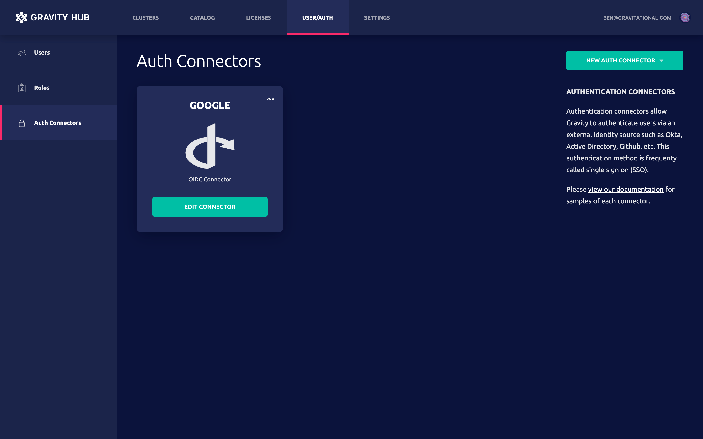
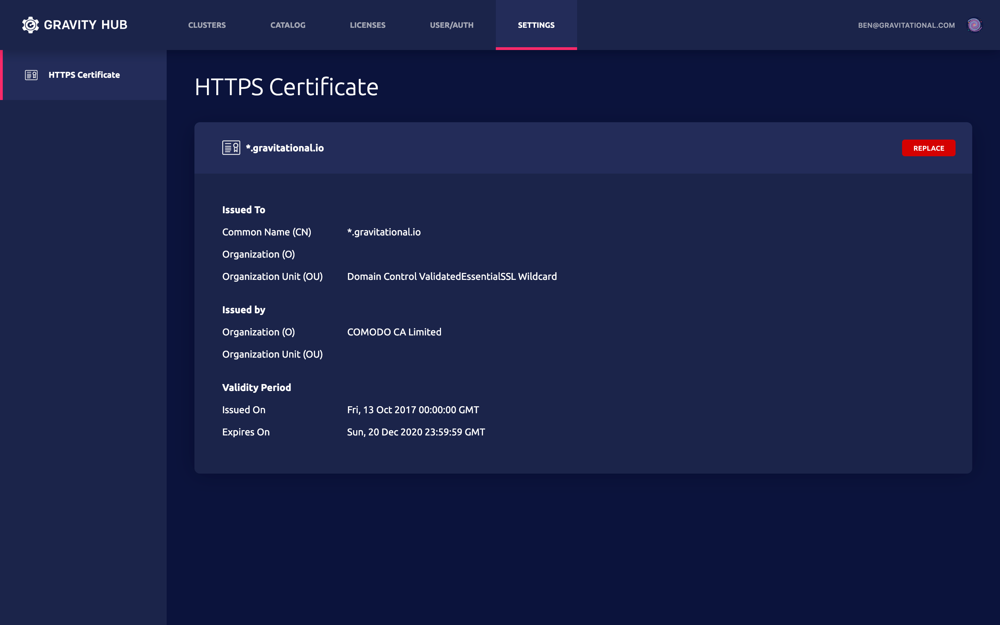
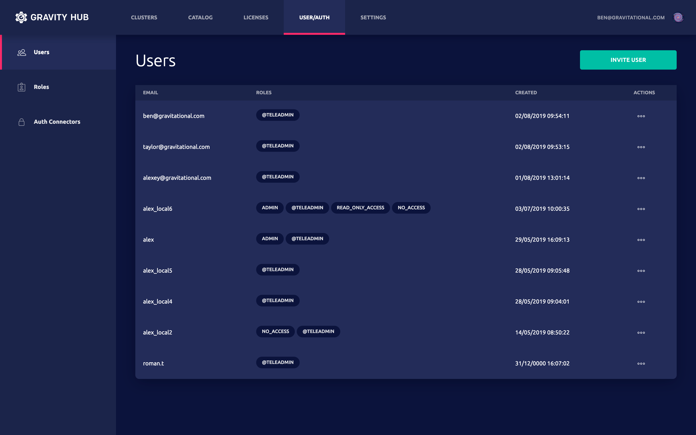

# Introduction

The Gravity Hub is a multi-cluster control plane available in the Enterprise
version of Gravity. It serves two purposes:

1. Gravity Hub acts as a central repository for Cluster Images, allowing an
   organization to share pre-built clusters.
2. Gravity Hub reduces the operational overhead of managing multiple Kubernetes
   clusters created from Cluster Images.

Users of Gravity Hub can:

* Publish Cluster Images and manage their versions.
* Download Cluster Images and quickly create production-ready clusters from them.
* Remotely manage Kubernetes clusters either via command line (CLI) or via a web interface.

This chapter will guide you through the process of downloading and installing
your own instance of Gravity Hub.

**Gravity Hub Catalog Example**


## Installing Gravity Hub

In this section we'll cover how to install your own instance of Gravity Hub
on your own infrastructure. The end result will be an autonomous Kubernetes
cluster with Gravity Hub running inside.

Gravity Hub itself is packaged and distributed as a Cluster Image, but you
also need an Enterprise version of `tele` CLI tool.  Please
[contact us](https://gravitational.com/gravity/demo/) to receive a trial license
key.

As with any Gravity Cluster Image, you will also need a Linux server to install
Gravity Hub. Assuming you have an enterprise version of `tele` CLI tool, pull
the Cluster Image:

```bash
$ tele pull hub:7.0.0
* Thu Apr 16 12:19:39 UTC Not logged in. Using default Gravitational Hub
* Thu Apr 16 12:19:39 UTC Requesting cluster image from https://get.gravitational.io
        Still requesting cluster image from https://get.gravitational.io (10 seconds elapsed)
* Thu Apr 16 12:19:52 UTC Downloading hub:7.0.0
        Still downloading hub:7.0.0 (10 seconds elapsed)
* Thu Apr 16 12:20:11 UTC Application hub:7.0.0 downloaded
* Thu Apr 16 12:20:11 UTC Download finished in 32 seconds 

$ ls -lh
-rw-r--r-- 1 user user 2.4G Apr 16 12:20 hub-7.0.0.tar
```

The name of the image doesn't have to be `hub:7.0.0`, it will vary based on the
version of Gravity you're using, so we'll refer to it simply as
`gravity-hub.tar` below.

Installing Gravity Hub is no different from installing any other Cluster Image,
as explained in the [Installation](installation.md) chapter.

To establish trust between Gravity Hub and future Kubernetes clusters, a common
shared hard-to-guess secret (token) must be generated first. Therefore, before
installing Gravity Hub, a shared token needs to be generated. You may want to
store it in an environment variable named `TOKEN` so it can be reused later:

```bash
# Generate a hard-to-guess token and store in an environment variable:
$ export TOKEN="$(uuidgen)"

# Next, expand the Cluster Image and launch the installer:
$ tar xvf ./gravity-hub.tar
$ ./gravity install --advertise-addr=10.1.1.5 \
                    --token=$TOKEN \
                    --flavor=standalone \
                    --cluster=hub.example.com \
                    --hub-advertise-addr=hub.example.com:443
```

* `--advertise-addr` is an IP address the Hub machine will be visible as.
* `--flavor=standalone` tells the installer to use a single machine to run
  Gravity Hub.  For production, we recommend to use a 3-node cluster for
  high-availability.
* `--hub-advertise-addr` should be a DNS name publicly accessible via internet
* `--token` is a security token for nodes to join to the cluster
* `--cluster` is a unique cluster name, e.g. `hub.example.com`

After `gravity install` from the example above completes, you'll have a single-node
Kubernetes cluster running with Gravity Hub inside.

Next, let's apply some minimal configuration on it.

## Post-provisioning

#### Setting up DNS

After provisioning of Gravity Hub cluster, create the DNS A-records pointing at
either the provisioned cloud load balancer (if the cluster was created on a
cloud account) or at the IP of the host.

!!! tip "Wildcard DNS name"
      The Gravity Hub DNS records must contain the wildcard, both `*.hub.example.com`
      and `hub.example.com` should point to the public IP address of the
      Gravity Hub cluster.

#### Setting up OIDC

After installation [OIDC provider](config.md#configuring-openid-connect) should be
set up in order to log into Gravity Hub.




#### Setting up TLS Key Pair

After installation, a valid [TLS key pair](config.md#tls-key-pair)
should be set up in order to log into Gravity Hub. Self-signed certificates are
currently not supported.



#### Configuring endpoints

By default, Gravity Hub is configured with a single endpoint set via
`--hub-advertise-addr` flag during the installation. This means that all
Gravity Hub clients will use this address to connect to it.

But Gravity Hub can also be configured to advertise different addresses to
users and remote Clusters via the `endpoints` resource. It has the following
format:

```yaml
kind: endpoints
version: v2
metadata:
  name: endpoints
spec:
  public_advertise_addr: "<public-host>:<public-port>"
  agents_advertise_addr: "<agents-host>:<agents-port>"
```

* `public_advertise_addr` is the address that will be used for Gravity Hub
  UI and by CLI tools such as tele or tsh. This field is mandatory.
* `agents_advertise_addr` is the address that remote Clusters will use to
  connect to Gravity Hub. This field is optional and it falls back to the
  public address if not specified.

Create the resource to update Gravity Hub endpoints:

```bsh
$ gravity resource create endpoints.yaml
```

!!! note 
    Updating the endpoints resource will result in restart of `gravity-site`
    pods so the changes can take effect.

To view currently configured endpoints, run:

```bsh
$ gravity resource get endpoints
```

Let's take a look at how Gravity Hub behavior changes with different endpoint
configurations.

#### Single advertise address

This is the default configuration, when `agents_advertise_addr` is either
not specified or equals to `public_advertise_addr`:

```yaml
spec:
  public_advertise_addr: "ops.example.com:443"
```

With this configuration, Gravity Hub Cluster will provide a single Kubernetes
service called `gravity-public` configured to serve both user and Cluster
traffic:

```bsh
$ kubectl get services -n kube-system -l app=gravity-hub
NAME             TYPE           CLUSTER-IP     EXTERNAL-IP   PORT(S)                                       AGE
gravity-public   LoadBalancer   10.100.20.71   <pending>     443:31033/TCP,3024:30561/TCP,3023:31043/TCP   40m
```

!!! tip "Setting up ingress"
    On cloud installations that support Kubernetes integration such as AWS, a
    load balancer will be created automatically, so you will only need to
    configure DNS to point the advertised hostname (`ops.example.com` in this
    example) to it. For onprem installations, an [ingress](ingress.md) should
    be configured for the appropriate NodePort of the service (`31033` in this example).

#### Same hostname, different port

In this scenario both user and Cluster traffic should be accessible on
the same hostname but on different ports:

```yaml
spec:
  public_advertise_addr: "ops.example.com:443"
  agents_advertise_addr: "ops.example.com:4443"
```

With this configuration, Gravity Hub will provide a single Kubernetes service
called `gravity-public` (which `ops.example.com` can point at) with two
different ports for user and Cluster traffic respectively:

```bsh
kubectl get services -n kube-system -l app=gravity-hub
NAME             TYPE           CLUSTER-IP     EXTERNAL-IP   PORT(S)                                                      AGE
gravity-public   LoadBalancer   10.100.20.71   <pending>     443:31265/TCP,4443:30080/TCP,3024:32109/TCP,3023:30716/TCP   54m
```

#### Different hostnames

In this scenario user and Cluster traffic have different advertise hostnames:

```yaml
spec:
  public_advertise_addr: "ops.example.com:443"
  agents_advertise_addr: "ops-agents.example.com:4443"
```

The ports may be the same or different which does not affect the general
behavior, only the respective service configuration.

With this configuration, an additional Kubernetes service called `gravity-agents`
is created for the Cluster traffic which `ops-agents.example.com` can be point at:

```bsh
# kubectl get services -n kube-system -l app=gravity-hub
NAME             TYPE           CLUSTER-IP      EXTERNAL-IP   PORT(S)                         AGE
gravity-public   LoadBalancer   10.100.20.71    <pending>     443:31792/TCP,3023:32083/TCP    59m
gravity-agents   LoadBalancer   10.100.91.204   <pending>     4443:30873/TCP,3024:30185/TCP   8s
```

## Upgrading

This section assumes that you have downloaded the newer version of Gravity Hub
Cluster Image called `new-hub.tar`. Log into a root terminal on one of the servers
running Gravity Hub and extract the tarball there:

```bsh
$ tar xvf new-hub.tar
```

Start the upgrade procedure using `upgrade` script:

```bsh
$ ./upgrade
```

Read more about upgrade procedure [here](cluster.md#performing-an-upgrade).

!!! tip "Ports":
    Users who use an external load balancer may need to update their
    configuration after the upgrade to reference new port assignments.

## Accessing Gravity Hub

You can log into Gravity Hub with `tsh login` command.

```bash
$ tsh --proxy=hub.example.com login
```

Based on the Gravity Hub configuration, the login command will open the web browser and users will have to go through a single sign-on (SSO) process with the identity provider of their choice.





## Publishing Cluster Images

Once logged into Gravity Hub, the commands below are used to manage the
publishing process.

Once a Cluster Image is built by `tele build`, it can be deployed and installed
by publishing it into the Gravity Hub.

```bash
# Use tele push to upload a Cluster Image to the Gravity Hub:
$ tele push [options] tarball.tar

Options:
  --force, -f  Forces to overwrite the already-published application if it exists.
```

`tele pull` will download a Cluster Image from the Gravity Hub:

```bash
$ tele [options] pull [application]

Options:
  -o   Name of the output tarball.
```

`tele rm app` deletes a Cluster Image from the Gravity Hub.

```bash
$ tele rm app [options] [application]

Options:
  --force  Do not return error if the application cannot be found or removed.
```

`tele ls` lists the Cluster Images currently published in the Gravity Hub:

```bash
$ tele [options] ls

Options:
  --all   Shows all available versions of images, instead of the latest versions only
```

## Remote Cluster Management

Gravity uses [Teleport](https://gravitational.com/teleport) to
connect to remote Clusters. Teleport is an open source privileged management
solution for both SSH and Kubernetes and it comes bundled with Gravity.


To see the list of Gravity Clusters available:

```bsh
$ tsh clusters
Name                          Status     Cloud Provider     Region
----                          ------     --------------     ------
east                          active     aws                us-east
west                          active     aws                us-west-2
```

Now you can make one of these Clusters "current":

```bash
$ tsh login west
```

This command will automatically update your local `kubeconfig` file with
Kubernetes credentials, and `kubectl` command will automatically connect
to the Cluster you've selected.

To see which Cluster is current, execute `tsh status` command.

Gravity Hub administrators can limit access to Clusters using `where`
expressions in roles and user traits fetched from identity providers.

#### Cluster RBAC Using Labels

Sometimes it is necessary to limit users access to a subset of Clusters via
Gravity Hub. For this, use Gravity Hub roles with `where` expressions in
their rules:


```yaml
kind: role
version: v3
metadata:
  name: developers
spec:
  allow:
    logins:
    - developers
    namespaces:
    - default
    kubernetes_groups:
    - admin
    rules:
    - resources:
      - role
      verbs:
      - read
    - resources:
      - app
      verbs:
      - list
    - resources:
      - cluster
      verbs:
      - connect
      - read
      where: contains(user.spec.traits["roles"], resource.metadata.labels["team"])
```

The role `developers` uses special property `user.spec.traits`
that contains user OIDC claims or SAML attribute statements after
users have successfully logged into Gravity Hub.

The property `resource.spec.labels["team"]` refers to cluster label `team`.
One can set cluster labels when creating Clusters via UI or CLI.

And finally `where` expression `contains(user.spec.traits["roles"], resource.metadata.labels["team"])`
matches members with `developers` OIDC claim or SAML attribute statement to have `admin`
Kubernetes access to Clusters marked with label `team:developers`

#### Cluster RBAC With Deny Rules

Users can use `deny` rules to limit access to some privileged Clusters:

```yaml
kind: role
version: v3
metadata:
  name: deny-production
spec:
  deny:
    namespaces:
    - default
    rules:
    - resources:
      - role
      verbs:
      - read
    - resources:
      - app
      verbs:
      - list
    - resources:
      - cluster
      verbs:
      - connect
      - read
      - list
      where: equals(resource.metadata.labels["env"], "production")
```

The role `deny-production` when assigned to the user, will limit access to all Clusters
with label `env:production`.

### SSH Into Nodes

Users can use `tsh ssh` command to SSH into any node inside any remote Clusters.
For example:

```bsh
$ tsh --cluster=east ssh admin@node2
```

You can also copy files using secure file copy AKA `scp`:

```bsh
$ tsh --cluster=east scp example.txt admin@node2:/path/to/dest/
```

`tsh ssh` supports all the usual flags `ssh` users are used to. You can forward
ports, execute commands and so on. Run `tsh help` for more information.
