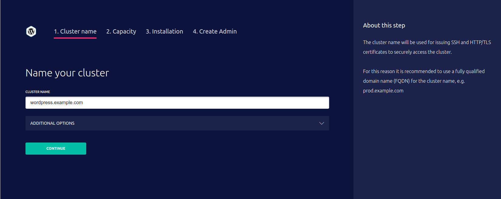
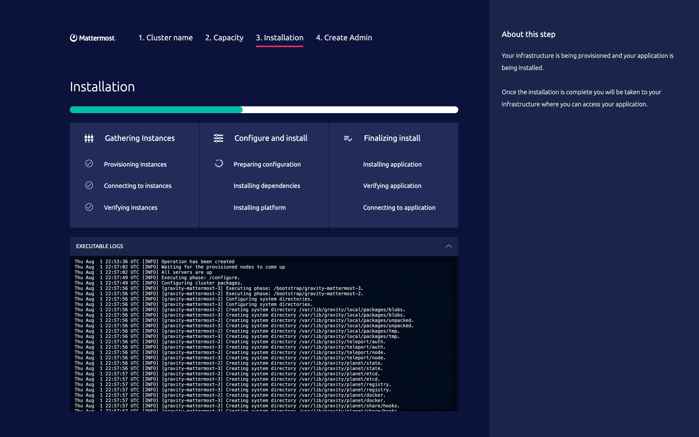

# Installation

This section will cover the process of creating a running Cluster or Cluster
Instance from a Cluster Image.  Just like a virtual machine (VM) image or AWS AMI
can be used to create machine instances, Gravity Cluster Images can
be used to create Cluster Instances.

#### Deployment Methods

Gravity supports two methods to create Clusters from Cluster Images:

* The command line interface (CLI) installer which is suitable for scripting.
* The graphical user interface (GUI) installer which serves an installation wizard
in a web browser, assisting users in Cluster creation.

Both installation methods allow users to create a new Cluster from a
Cluster Image on Linux hosts. Because a Cluster Image has no external
dependencies, both installation methods will work behind firewalls or even in
air-gapped server rooms.

#### Prerequisites

Every Cluster Image created with Gravity contains everything you need to
create a production-ready Cluster but there are still some pre-requisites
to be met:

* You need a valid Cluster Image, i.e. a `.tar` file. See the
  [Building Cluster Images](pack.md) section for information on how to build one.
* One or more Linux hosts with a compatible kernel. They can be bare metal hosts,
  compute instances on any cloud provider, virtual machines on a private cloud,
  etc. Consult with the [System Requirements](requirements.md) to determine if your
  Linux hosts are compatible with Gravity.
* The hosts should be clean without Docker or any container
  orchestrator running on them.
* The hosts should be able to connect to each other, i.e. on the same
  private network.
* You need the ability to create DNS entries for public access points.
* You need to be able to obtain valid SSL/TLS certificates for HTTPS.

## CLI Installation

To create a new instance of a Cluster Image via command line, you must do the
following:

1. First, copy the Cluster Image file onto all nodes.
2. Untar it on all nodes.
3. Pick a "master node", i.e. the node which will serve as the initial
   Kubernetes master.
4. Execute `./gravity install` on the master node.
5. Execute `./gravity join` on the other nodes.

Copying files around is easy, so let's take a deeper look into steps 2 through 5.
Once the Cluster Image is unpacked, it is going to look similar to this on each node:

```bash
$ tar -xf cluster-image.tar
$ ls -lh
-rwxr--r-- 1 user staff 21K  Oct 24 12:01 app.yaml
-rwxr--r-- 1 user staff 56M  Oct 24 12:01 gravity
-rwxr--r-- 1 user staff 256K Oct 24 12:01 gravity.db
-rwxr--r-- 1 user staff 679  Oct 24 12:01 install
-rwxr--r-- 1 user staff 170  Oct 24 12:01 packages
-rw-r--r-- 1 user staff 1.1K Oct 24 12:01 README
-rwxr--r-- 1 user staff 170  Oct 24 12:01 upgrade
-rwxr--r-- 1 user staff 170  Oct 24 12:01 upload
```

Next, bootstrap the master node:

```bash
# execute this on the master node, which in this case has an IP of 10.1.10.1
$ sudo ./gravity install --advertise-addr=10.1.10.1 --token=XXX --flavor="triple"
```

* Note the use of `--flavor` argument which selects a Cluster configuration for 3
  nodes, borrowing from the example shown in the [Image Manifest](pack.md#image-manifest) section.
* You have to select an arbitrary, hard to guess secret for `--token` and remember this
  value. It will be used to securely add additional nodes to the Cluster.
* Other nodes must be able to connect to the master node via `10.1.10.1`. Make sure
  the installer ports are not blocked, see "Installer Ports" section in the
  [System Requirements](requirements.md#network) chapter.

Next, start adding remaining nodes to the Cluster:

```bash
# must be executed on the node which you want to be the "database":
$ sudo ./gravity join 10.1.10.1 --advertise-addr=10.1.10.2 --token=XXX --role="database"
```

```bash
# must be executed on the node which you want to be the "worker":
$ sudo ./gravity join 10.1.10.1 --advertise-addr=10.1.10.3 --token=XXX --role="worker"
```

!!! tip
    The node roles in the example above are borrowed from the Image Manifest documented
    in [Building Cluster Images](pack.md#image-manifest) section. The use of `--role`
    argument is optional if the Image Manifest did not contain node roles.

The `gravity join` command will connect the worker and the database nodes to the master and you
will have a fully functioning, production-ready Kubernetes Cluster up and running.

Execute `gravity install --help` to see the list of supported command line arguments, but
the most frequently used ones are listed below:

Flag               | Description
-------------------|-------------
`--token`          | Secure token which prevents rogue nodes from joining the Cluster during installation. Carefully pick a hard-to-guess value.
`--advertise-addr` | The IP address this node should be visible as. **This setting is mandatory** to correctly configure Kubernetes on every node.
`--role`           | _(Optional)_ Application role of the node.
`--cluster`        | _(Optional)_ Name of the Cluster. Auto-generated if not set.
`--cloud-provider` | _(Optional)_ Enable cloud provider integration: `generic` (no cloud provider integration), `aws` or `gce`. Autodetected if not set.
`--flavor`         | _(Optional)_ Application flavor. See [Image Manifest](pack.md#image-manifest) for details.
`--config`         | _(Optional)_ File with Kubernetes/Gravity resources to create in the Cluster during installation.
`--pod-network-cidr` | _(Optional)_ CIDR range Kubernetes will be allocating node subnets and pod IPs from. Must be a minimum of /16 so Kubernetes is able to allocate /24 to each node. Defaults to `10.244.0.0/16`.
`--service-cidr`     | _(Optional)_ CIDR range Kubernetes will be allocating service IPs from. Defaults to `10.100.0.0/16`.
`--wizard`           | _(Optional)_ Start the installation wizard.
`--state-dir`        | _(Optional)_ Directory where all Gravity system data will be kept on this node. Defaults to `/var/lib/gravity`.
`--service-uid`      | _(Optional)_ Service user ID (numeric). See [Service User](pack.md#service-user) for details. A user named `planet` is created automatically if unspecified.
`--service-gid`      | _(Optional)_ Service group ID (numeric). See [Service User](pack.md#service-user) for details. A group named `planet` is created automatically if unspecified.
`--dns-zone`         | _(Optional)_ Specify an upstream server for the given DNS zone within the Cluster. Accepts `<zone>/<nameserver>` format where `<nameserver>` can be either `<ip>` or `<ip>:<port>`. Can be specified multiple times.
`--vxlan-port`       | _(Optional)_ Specify custom overlay network port. Default is `8472`.
`--remote` | _(Optional)_ Excludes this node from the Cluster, i.e. allows to bootstrap the Cluster from a developer's laptop, for example. In this case the Kubernetes master will be chosen randomly.
`--selinux` | _(Optional)_ Turns on SELinux support. Defaults to `false`. See [SELinux](selinux.md) for more details.

The `gravity join` command accepts the following arguments:

Flag               | Description
-------------------|-------------
`--token`          | Secure token which prevents rogue nodes from joining the Cluster during installation. Carefully pick a hard-to-guess value.
`--advertise-addr` | The IP address this node should be visible as. **This setting is mandatory** to correctly configure Kubernetes on every node.
`--role`           | _(Optional)_ Application role of the node.
`--cloud-provider` | _(Optional)_ Cloud provider integration, `generic` or `aws`. Autodetected if not set.
`--mounts`         | _(Optional)_ Comma-separated list of mount points as <name>:<path>.
`--state-dir`      | _(Optional)_ Directory where all Gravity system data will be kept on this node. Defaults to `/var/lib/gravity`.
`--service-uid`    | _(Optional)_ Service user ID (numeric). See [Service User](pack.md#service-user) for details. A user named `planet` is created automatically if unspecified.
`--service-gid`    | _(Optional)_ Service group ID (numeric). See [Service User](pack.md#service-user) for details. A group named `planet` is created automatically if unspecified.
`--selinux` | _(Optional)_ Turns on SELinux support. Defaults to `false`. See [SELinux](selinux.md) for more details.

### Environment Variables

Some aspects of the installation can be configured with the use of environment variables.

#### `GRAVITY_CHECKS_OFF`

This environment variable controls whether the installer/join agent executes the preflight checks.
It accepts values `1`, `t`, `T`, `TRUE`, `true`, `True`, `0`, `f`, `F`, `FALSE`, `false`, `False`
- any other value will not have any effect.

!!! warning "Scope"
    Currently it is not possible to selectively turn checks off.

#### `GRAVITY_PEER_CONNECT_TIMEOUT`

This environment variable controls the initial connection validation timeout for the joining agent.
It accepts values in Go duration format, for example `1m` (one minute) or `20s` (twenty seconds).
The default value is `10s`.

!!! note
    Only configurable for Gravity versions `5.5.x` starting `5.5.24`.

#### `GRAVITY_ETCD_MIN_IOPS_SOFT` / `GRAVITY_ETCD_MIN_IOPS_HARD`

These environment variables allow to override the default soft/hard limits for
the minimum number of sequential write IOPS used by Gravity during etcd data
disk performance preflight check.

The variable accepts an integer number indicating a number of IOPS. The default
soft limit (triggers a warning) is `50` IOPS and the default hard limit (triggers
a failure) is `10` IOPS.

#### `GRAVITY_ETCD_MAX_LATENCY_SOFT` / `GRAVITY_ETCD_MAX_LATENCY_HARD`

These environment variables allow to override the default soft/hard limits for
the maximum fsync latency in milliseconds used by Gravity during etcd data disk
performance preflight check.

The variable accepts an integer number indicating a number of milliseconds. The
default soft limit (triggers a warning) is `50` ms and the default hard limit
(triggers a failure) is `150` ms.

## Web-based Installation

The web-based installation allows a more interactive user experience. Instead of
specifying installation parameters via CLI arguments, users can follow the
installation wizard using a web browser.

To illustrate how this works, let's use the same set of assumptions from the CLI
installation section above:

* There are 3 clean Linux machines available. One will be the "master" and the
  other two are "database" and "worker" respectively.
* A user has remote access to all 3 machines, most likely via SSH.
* A user also has their personal laptop with a web browser.

To install using the graphical wizard, a Linux computer with a browser is
required and the target servers need to be reachable via port `3012`. The node
running the wizard must have its port `61009` accessible by other servers.

The installation wizard is launched by typing `./install` script and will guide
the end user through the installation process.




### Troubleshooting Installs

The installation process is implemented as a state machine split into multiple steps (phases).
Every time a step fails, the install pauses and allows one to inspect and correct the cause of the failure.

If the installation has failed, the installer will print a warning and pause:

```bsh
root$ ./gravity install
Tue Apr 10 13:44:07 UTC	Starting installer
Tue Apr 10 13:44:09 UTC	Preparing for installation
Tue Apr 10 13:44:32 UTC	Installing application my-app:1.0.0-rc.1
Tue Apr 10 13:44:32 UTC	Starting non-interactive install
Tue Apr 10 13:44:32 UTC	Bootstrapping local state
Tue Apr 10 13:44:33 UTC	All agents have connected!
Tue Apr 10 13:44:33 UTC	Starting the installation
Tue Apr 10 13:44:34 UTC	Operation has been created
Tue Apr 10 13:44:35 UTC	Execute preflight checks
Tue Apr 10 13:44:37 UTC	Operation has failed
Tue Apr 10 13:44:37 UTC	Installation failed in 4.985481556s, check ./telekube-install.log
---
Installer process will keep running so you can inspect the operation plan using
`gravity plan` command, see what failed and continue plan execution manually
using `gravity install --phase=<phase-id>` command after fixing the problem.
Once no longer needed, this process can be shutdown using Ctrl-C.
```

To inspect the installer's progress, use the `plan` command:

```bsh
root$ ./gravity plan
Phase                  Description                                                               State         Requires                  Updated
-----                  -----------                                                               -----         --------                  -------
⚠ checks               Execute preflight checks                                                  Failed        -                         Tue Apr 10 13:44 UTC
* configure            Configure packages for all nodes                                          Unstarted     -                         -
* bootstrap            Bootstrap all nodes                                                       Unstarted     -                         -
  * node-1             Bootstrap master node node-1                                              Unstarted     -                         -
* pull                 Pull configured packages                                                  Unstarted     /configure,/bootstrap     -
  * node-1             Pull packages on master node node-1                                       Unstarted     /configure,/bootstrap     -
* masters              Install system software on master nodes                                   Unstarted     /pull                     -
  * node-1             Install system software on master node node-1                             Unstarted     /pull/node-1
...

Phase Execute preflight checks (/checks) failed.
Error:
server("node-1", 192.168.121.23) failed checks:
	⚠ fs.may_detach_mounts should be set to 1 or pods may get stuck in the Terminating state, see https://www.gravitational.com/docs/faq/#kubernetes-pods-stuck-in-terminating-state
```

After fixing the error (i.e. enabling the kernel parameter in this example), resume the installation:

```bsh
root$ sysctl -w fs.may_detach_mounts=1
root$ ./gravity install --resume
Tue Apr 10 13:55:26 UTC	Executing "/checks" locally
Tue Apr 10 13:55:26 UTC	Running pre-flight checks
Tue Apr 10 13:55:28 UTC	Executing "/configure" locally
Tue Apr 10 13:55:28 UTC	Configuring Cluster packages
Tue Apr 10 13:55:32 UTC	Executing "/bootstrap/node-1" locally
Tue Apr 10 13:55:32 UTC	Configuring system directories
Tue Apr 10 13:55:35 UTC	Configuring application-specific volumes
Tue Apr 10 13:55:36 UTC	Executing "/pull/node-1" locally
Tue Apr 10 13:55:36 UTC	Pulling user application
Tue Apr 10 13:55:46 UTC	Still pulling user application (10 seconds elapsed)
...
Tue Apr 10 14:01:07 UTC	Executing "/app/my-app" locally
Tue Apr 10 14:01:08 UTC	Executing "/election" locally
Tue Apr 10 14:01:08 UTC	Enable leader elections
Tue Apr 10 14:01:09 UTC	Executing install phase "/" finished in 5 minutes

```

The following CLI flags are useful to manage the install operation:


Flag      | Description
----------|-------------
`--phase` | Specifies the name of the step to execute. Use `gravity plan` to display the list of all steps.
`--force` | Force execution of the step even it is already in-progress.
`--resume` | Resume operation after the failure. The operation is resumed from the step that failed last.
`--manual` | Launch operation in manual mode.


## Generic Linux Hosts

In order to reliably run in any environment, Gravity aims to be infrastructure
and cloud-agnostic. Gravity makes no assumption about the nature of the network
or either the hosts are virtualized or bare metal.

## AWS

The default behavior of `gravity install` CLI command will change when
it detects that it's running on a AWS instance. Kubernetes networking will
be configured with AWS native network features. For more information see
[Kubernetes AWS documentation](https://kubernetes.io/docs/setup/production-environment/turnkey/aws/).

Before installation make sure that AWS instances intended to run Gravity
satisfy all of Gravity [system requirements](requirements.md). In addition to these
generic requirements, AWS instances also must be configured in the following way to
ensure proper AWS integration:

* Instances must have an [IAM role with sufficient permissions](requirements.md#aws-iam-policy).

Once the AWS instances have been properly provisioned, launch Gravity installation as
[described above](#cli-installation).  Either omit the `--cloud-provider` flag or
specify `--cloud-provider=aws` to enable AWS integration. AWS integration can be
disabled by specifying the `--cloud-provider=generic` flag.

## Azure

Gravity can be successfully deployed into an Azure environment using the same
approach as [Generic Linux Hosts](#generic-linux-hosts).

## Google Compute Engine

The default behavior of `gravity install` CLI command will change when
it detects that it's running on a GCE instance. Kubernetes networking will
be configured with GCP native network features. For more information see
[Kubernetes GCE Documentation](https://kubernetes.io/docs/setup/production-environment/turnkey/gce/).

Before installation make sure that GCE instances intended to run Gravity
satisfy all of Gravity [system requirements](requirements.md). In addition to these
generic requirements, GCE instances also must be configured in the following way to
ensure proper cloud provider integration:

* Network interface must have IP forwarding turned on. This is required for the
overlay network to work properly. See [Google Cloud's Documentation](https://cloud.google.com/vpc/docs/using-routes#canipforward)
* Instances must be assigned a [network tag](https://cloud.google.com/vpc/docs/add-remove-network-tags)
matching the name of the Cluster. This is required to ensure that created load
balancers discover proper instances.
* Instance Cloud API access scopes must include read/write permissions for Compute Engine.
This is required to create routes between nodes. For a more detailed list of required
permissions see [GCE IAM Policy](requirements.md#gce-iam-policy) requirements.

Once the GCE instances have been properly provisioned, launch Gravity installation as
[described above](#cli-installation).  Either omit the `--cloud-provider` flag or
specify `--cloud-provider=gce` to enable GCE integration. GCE integration can be
disabled by specifying the `--cloud-provider=generic` flag.
