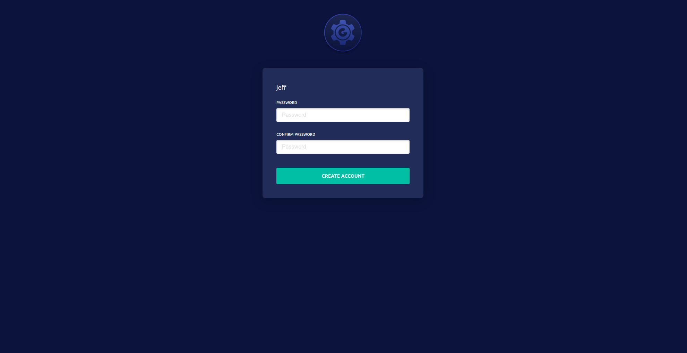

# Introduction

This guide will help you quickly evaluate Gravity by packaging, and installing
a sample multi-node Kubernetes application. 

We will use [Mattermost](https://www.mattermost.org/), an open source chat
application for teams. Mattermost represents a fairly typical web application
and consists of an HTTP request handling process which connects to a PostgreSQL
instance.

Before we start, you may want to go over the [Gravity Overview](index.md) to
get familiar with basic concepts of the Gravity solution.

You can also watch the video below which walks through this Quickstart Guide.

<iframe width="768" height="432" src="https://www.youtube.com/embed/ixMKjK0F4Uk?rel=0" frameborder="0" allow="accelerometer; autoplay; encrypted-media; gyroscope; picture-in-picture" allowfullscreen></iframe>

!!! note "Note on Quickstart Video"
    The video uses version 5.4 of Gravity, so users of newer versions of Gravity may have a slightly different experience.

## System Requirements

Gravity is a Kubernetes packaging solution so it only runs on computers capable
of running Kubernetes. For this tutorial, you will need:

* A x86_64 Linux machine or a VM for building a Cluster Image that is running one of the [supported Linux distributions](requirements.md#linux-distributions).
* Docker version 17 or newer. Run `docker info` before continuing to make sure
  you have Docker up and running. We recommend following instructions on [installing Docker CE from Docker.com](https://docs.docker.com/install/)
* You must be a member of the `docker` group. Run `groups` command to make sure
  `docker` group is listed. If not, you can add yourself to the "docker" group via `sudo usermod -aG docker $USER`
* You must install [Helm 2.0](https://docs.helm.sh/using_helm/#installing-helm) - [Helm v2.12 Github Release](https://github.com/helm/helm/releases/tag/v2.12.3).
* You must have `git` installed to clone the example application repo.
* A _target cluster_ of Linux nodes. It can be just one machine but this example quickstart will use three. The nodes in a target cluster must have at least 2GB of RAM and 40GB of free disk space. They must **_not_** have Docker or any other container runtime installed on them.
* You must have `sudo` privileges on all nodes.

## Getting the Tools

Start by [downloading Gravity](https://gravitational.com/gravity/download/) and
unpacking the archive. You should see the following files:

```
$ ls -l
-rwxr-xr-x 1 user user      128 Dec  3 13:07 install.sh
-rwxr-xr-x 1 user user 50562960 Dec  3 13:07 tele
-rwxr-xr-x 1 user user 21417992 Dec  3 13:07 tsh
```

Execute `install.sh` to copy `tele` and `tsh` binaries to
`/usr/local/bin/`. Then you can type `tele version` to confirm that
everything works:

```
$ tele version
Edition:	open-source
Version:	6.2.0
Git Commit:	59f55954483989fef11bbe47a91c4d09743f65fe
Helm Version:	v2.12
```

Clone the sample Git repository which contains the Kubernetes resources for
[Mattermost](https://www.mattermost.org/), which we are using in this tutorial as a sample application:

```bsh
$ git clone https://github.com/gravitational/quickstart.git
$ cd quickstart
```

## Building a Cluster Image

To build a Cluster Image we'll perform the following steps:

1. Create Docker containers for application services. 
2. Create definitions of Kubernetes resources (pods, etc) for application
   components. This makes an application capable of running on Kubernetes. 
   You can place all Kubernetes resource files (usually in YAML format) in the 
   same directory or you can use Helm.
3. Create a Cluster Image Manifest to describe the system requirements
   for a Kubernetes cluster capable of running your application. A Cluster Image Manifest
   is a YAML file which allows you to customize the Cluster Image.
4. Execute `tele build` CLI command.

### Step 1: Containerizing

Run the following to build the Mattermost containers:

```bsh
$ cd mattermost/worker
$ docker build -t mattermost-worker:2.2.0 .
```

When Docker finishes building the container, you should be able to see it listed:

```
$ docker images | grep mattermost
mattermost-worker      2.2.0       ce3ead6dff48     43 seconds ago      405MB
```

You can now return to the quickstart home directory.

### Step 2: Creating the Kubernetes Resources

Making Mattermost run on Kubernetes is easy. The quickstart repository you have
cloned above includes the YAML definitions of Kubernetes objects. We'll use
a Helm chart for this:

```
$ tree mattermost/resources/charts/mattermost/
mattermost/resources/charts/mattermost/
├── Chart.yaml
├── templates
│   ├── _helpers.tpl
│   └── mattermost.yaml
└── values.yaml
```
The most interesting file to take a look at is [mattermost.yaml](https://github.com/gravitational/quickstart/blob/master/mattermost/resources/charts/mattermost/templates/mattermost.yaml).
You are welcome to modify it to your liking.

!!! tip "Tip"
    In this tutorial, we are packaging a single Helm chart but it is possible
    to have several of them packaged into a single Cluster Image.

### Step 3: Creating the Cluster Image Manifest

In this step, we create an Image Manifest which describes the system
requirements for the Cluster.

We have already prepared one for this guide in the cloned repo: `mattermost/resources/app.yaml`. You can [open it on Github](https://github.com/gravitational/quickstart/blob/master/mattermost/resources/app.yaml) for convenience. We have commented the most important fields
in the example manifest.

### Step 4: Building the Cluster Image

Before we build our first Cluster Image, let's make sure [Helm](https://helm.sh/) is properly
initialized.

```bash
$ helm init --client-only
```

Now you can build the Cluster Image, which will consist of a Kubernetes
cluster with Mattermost pre-installed inside:

```bsh
$ tele build -o mattermost.tar mattermost/resources/app.yaml

# the output:
* [1/6] Selecting application runtime
	Will use latest runtime version 5.2.4
* [2/6] Downloading dependencies from s3://hub.gravitational.io
	Still downloading dependencies from s3://hub.gravitational.io (10 seconds elapsed)
	Still downloading dependencies from s3://hub.gravitational.io (20 seconds elapsed)
* [3/6] Embedding application container images
	Detected application manifest app.yaml
	Detected resource file clusterDeprovision.yaml
	Detected resource file clusterProvision.yaml
	Detected resource file install.yaml
	Detected resource file nodesDeprovision.yaml
	Detected resource file nodesProvision.yaml
	Detected Helm chart charts/mattermost
	Using local image quay.io/gravitational/debian-tall:0.0.1
	Using local image quay.io/gravitational/debian-tall:0.0.1
	Using local image quay.io/gravitational/provisioner:ci.82
	Using local image mattermost-worker:2.2.0
	Using local image postgres:9.4.4
	Vendored image gravitational/debian-tall:0.0.1
	Vendored image gravitational/provisioner:ci.82
	Still embedding application container images (10 seconds elapsed)
	Vendored image mattermost-worker:2.2.0
	Vendored image postgres:9.4.4
* [4/6] Using runtime version 5.2.4
	Still using runtime version 5.2.4 (10 seconds elapsed)
* [5/6] Generating the cluster snapshot
* [6/6] Saving the snapshot as mattermost.tar
* [6/6] Build completed in 2 minutes
```

Let's review what just happened. `tele build` did the following:

* Downloaded Kubernetes binaries and Gravity tooling from `s3://hub.gravitational.io`.
* Scanned the current directory and the subdirectories for Kubernetes resources and Helm charts.
* Downloaded external container images referenced in the resources discovered in the previous step.
* Packaged (or vendored) Docker images into the Cluster Image.
* Removed the duplicate container image layers, reducing the size of the Cluster Image.
* Saved the Cluster Image as `mattermost.tar`.

!!! warning "Slow Operation Warning"
    `tele build` needs to download hundreds of megabytes of binary dependencies which
    can take a considerable amount of time, depending on your Internet connection speed.

The resulting `mattermost.tar` file is about 1.6GB and it is **entirely
self-sufficient** and dependency-free. It contains everything: the Kubernetes
binaries, the Docker engine, the Docker registry and the Mattermost application itself:
everything one needs to get Mattermost up and running on any fleet of Linux
servers (or into an AWS/GCE/Azure account).

Congratulations! You have created your first **Kubernetes virtual appliance**!


## Installing

Installing the `mattermost.tar` Cluster Image results in creating a Kubernetes
cluster with the application pre-loaded. This file is the only artifact
one needs to create a Kubernetes cluster with Mattermost running inside.

Copy `mattermost.tar` to a clean Linux machine. Let's call it `host`. This node
will be used to bootstrap the cluster. Let's untar it and look inside:

```bash
$ tar -xf mattermost.tar
$ tree
├── app.yaml
├── gravity
├── gravity.db
├── install
├── packages
│   ├── blobs
│   │   ├── 0e1
│   │   ...
│   │   └── ff1
│   │       └── ff19bcf2dc62f037e0016d5d065150d195f714be3c97a301791365a4ec5a43f0
│   ├── tmp
│   └── unpacked
├── README
├── upgrade
└── upload
```

Here is a brief description of these files:

File Name    | Description
-------------|------------------------
`gravity`    | Gravity Cluster manager which is a Linux binary (executable). It's responsible for installing, upgrading and managing clusters.
`app.yaml`   | The Image Manifest which we've defined earlier and fed to `tele build`. You'll notice that the build process populated the manifest with additional metadata.
`packages`   | The database of Docker image layers for all containers and other binary artifacts, like Kubernetes binaries.
`gravity.db` | The metadata of what's stored in `packages`.
`upgrade`, `install`, `upload` | Helpful bash wrappers around `gravity` commands.
`README`     | Instructions for the end user.

Gravity supports two modes of installation:

* **CLI mode** or non-interactive mode is useful for advanced users
  and for scripting. It allows clusters to be created programmatically or via
  command line.
* **Web mode** uses a web browser to guide a user through an installation wizard.
  This mode is useful for non-technical users, sales demos, etc.

### Installing via CLI

To install a Cluster via CLI, you have to execute the `./gravity install` command and
supply two mandatory flags:

Flag              | Description
-------------------|---------------------------------
`--token`          | A secret token of your choosing which will be used to add additional nodes to this Cluster in the future. We'll use word "secret" here.
`--advertise-addr` | The IP address this host will be visible on by other nodes in this Cluster. We'll use `10.5.5.28`.

The command below will create a single-node Kubernetes cluster with Mattermost running inside:

```
# We are executing this on the node named 'host' with IP address of 10.5.5.28
$ sudo ./gravity install \
        --advertise-addr=10.5.5.28 \
        --token=secret
# Output:
Sat Jan 12 05:30:44 UTC Starting installer
Sat Jan 12 05:30:44 UTC Preparing for installation...
Sat Jan 12 05:31:09 UTC Installing application mattermost:2.2.0
Sat Jan 12 05:31:09 UTC Starting non-interactive install
Fri Jan 11 21:31:09 UTC Auto-loaded kernel module: br_netfilter
Fri Jan 11 21:31:09 UTC Auto-loaded kernel module: iptable_nat
Fri Jan 11 21:31:09 UTC Auto-loaded kernel module: iptable_filter
Fri Jan 11 21:31:09 UTC Auto-loaded kernel module: ebtables
Fri Jan 11 21:31:09 UTC Auto-set kernel parameter: net.ipv4.ip_forward=1
Fri Jan 11 21:31:09 UTC Auto-set kernel parameter: net.bridge.bridge-nf-call-iptables=1
Sat Jan 12 05:31:10 UTC All agents have connected!
Sat Jan 12 05:31:10 UTC Starting the installation
Sat Jan 12 05:31:11 UTC Operation has been created
Sat Jan 12 05:31:12 UTC Execute preflight checks
Sat Jan 12 05:31:16 UTC Configure packages for all nodes
Sat Jan 12 05:31:20 UTC Bootstrap master node host
Sat Jan 12 05:31:24 UTC Pull packages on master node host
Sat Jan 12 05:32:20 UTC Install system package teleport:2.4.7 on master node host
Sat Jan 12 05:32:22 UTC Install system package planet:5.2.19-11105 on master node host
Sat Jan 12 05:32:48 UTC Wait for system services to start on all nodes
Sat Jan 12 05:33:24 UTC Label and taint master node host
Sat Jan 12 05:33:25 UTC Bootstrap Kubernetes roles and PSPs
Sat Jan 12 05:33:26 UTC Export applications layers to Docker registries
Sat Jan 12 05:33:27 UTC Populate Docker registry on master node host
Sat Jan 12 05:34:24 UTC Install system application dns-app:0.1.0
Sat Jan 12 05:34:31 UTC Install system application logging-app:5.0.2
Sat Jan 12 05:35:05 UTC Install system application tiller-app:5.2.1
Sat Jan 12 05:35:43 UTC Install system application site:5.2.4
Sat Jan 12 05:36:59 UTC Install system application kubernetes:5.2.4
Sat Jan 12 05:37:00 UTC Install application mattermost:2.2.0
Sat Jan 12 05:37:10 UTC Enable elections
Sat Jan 12 05:37:12 UTC Operation has completed
Sat Jan 12 05:37:13 UTC Installation succeeded in 6m3.257480586s
```

**Congratulations!** You have created a fully functional Kubernetes cluster
with Mattermost running inside. To check the health and status of the Cluster,
execute this command on the target node:

```bash
$ gravity status

# the output:
Cluster status:	active
Application:	mattermost, version 2.2.0
Join token:	3f59d1923ed4e2f1499f3e272c86310b46666c8ddce708f3131b16f256f10004
Last completed operation:
    * operation_install (6784ad01-530a-45f0-a303-119ac8cd3417)
      started:		Tue Jan 22 22:40 UTC (10 minutes ago)
      completed:	Tue Jan 22 22:40 UTC (10 minutes ago)
Cluster:		friendlypoincare4048
    Masters:
        * host (10.5.5.28, node)
            Status:	healthy
```

If a single node cluster is not enough, you can add additional nodes to it:

1. Copy `gravity` binary from the bootstrapping node above to another host which
   is about to be added to the Cluster.  Let's assume its IP is `10.5.5.29`.
2. Execute `gravity join` command as shown below. Note that this command will
   "think" in silence for a few seconds before dumping any output.

```bash
# Execute this on the second node with an IP 10.5.5.29
$ sudo ./gravity join 10.5.5.28 --advertise-addr=10.5.5.29 --token=secret

# Output:
Sat Jan 12 06:00:16 UTC	Connecting to cluster
Fri Jan 11 22:00:16 UTC	Auto-loaded kernel module: br_netfilter
Fri Jan 11 22:00:16 UTC	Auto-loaded kernel module: iptable_nat
Fri Jan 11 22:00:16 UTC	Auto-loaded kernel module: iptable_filter
Fri Jan 11 22:00:16 UTC	Auto-loaded kernel module: ebtables
Fri Jan 11 22:00:16 UTC	Auto-set kernel parameter: net.ipv4.ip_forward=1
Fri Jan 11 22:00:16 UTC	Auto-set kernel parameter: net.bridge.bridge-nf-call-iptables=1
Sat Jan 12 06:00:16 UTC	Connected to existing cluster at 10.5.5.28
Sat Jan 12 06:00:17 UTC	Operation has been created
Sat Jan 12 06:00:18 UTC	Configure packages for the joining node
Sat Jan 12 06:00:20 UTC	Bootstrap the joining node
Sat Jan 12 06:00:21 UTC	Pull packages on the joining node
Sat Jan 12 06:01:18 UTC	Install system package teleport:2.4.7
Sat Jan 12 06:01:19 UTC	Install system package planet:5.2.19-11105
Sat Jan 12 06:01:41 UTC	Start RPC agent on the master node 10.5.5.28
Sat Jan 12 06:01:45 UTC	Add the joining node to the etcd cluster
Sat Jan 12 06:01:49 UTC	Wait for the planet to start
Sat Jan 12 06:02:24 UTC	Stop RPC agent on the master node 10.5.5.28
Sat Jan 12 06:02:25 UTC	Enable leader election on the joined node
Sat Jan 12 06:02:26 UTC	Operation has completed
Sat Jan 12 06:02:26 UTC	Joined cluster in 2m10.547146946s
```

Now you have a two-node Kubernetes cluster with Mattermost running inside.
The next step is to create a new Kubernetes user:

```bash
# execute this on the K8s master node (running on 10.5.5.28 in our example)
# to create a user "ekontsevoy"
$ gravity users add --roles=@teleadmin ekontsevoy

# output:
Signup token has been created and is valid for 8h0m0s hours. Share this URL with the user:
https://10.5.5.28:3009/web/newuser/e5b5422da69ff44d41f92e3ce6167659a7fee10e1023acea22062141dfe0238e
```




Now click on the printed URL and select a password. You are now inside the Cluster
Control Panel. You can bookmark the following URL to access it in the future: `https://10.5.5.28:32009/web/`


You will also see that this Cluster is running Mattermost inside, accessible as a Kubernetes service
on port `32010`, i.e. it's accessible using IP addresses of both machines in the Cluster:

* `http://10.5.5.28:32010/`
* `http://10.5.5.29:32010/`

### Installing via Web Browser

This method of installation launches a graphical installation wizard in a web browser.

To launch a web installer, you will need:

* The Cluster Image `mattermost.tar` which we have prepared earlier.
* A Linux computer with a graphical interface and web browser connected to the same network as the target nodes.

First, untar `mattermost.tar` and execute the `install` script. This command
launches an HTTP server which serves a web UI and acts as a bootstrapping agent
to create a new Cluster. It will print a web URL for you to click
on or paste in your browser.

```bash
$ sudo ./install
OPEN THIS IN BROWSER: https://host:61009/web/installer/new/gravitational.io/mattermost/2.2.0?install_token=2a9de4a72ede
```

**If you don't have TLS setup you might see this error message. Click Advanced -> Proceed **


The browser-based installer will ask for the following:

* Name of your Cluster. We recommend FQDN-like names like
  `mattermost.example.com`.


* The network interface to use. This must be the interface which Kubernetes
  nodes will use to talk to each other.


* The "flavor" of the Cluster, i.e. 1, 2 or 3 nodes. The installer will provide a CLI
  command to copy to and execute on each node.
* Once all nodes report into the Cluster, the installer will proceed setting up
  Kubernetes.


The final step is to select the user name and password for the administrator. You will be able to change it later (or configure the SSO). Once you are logged in, you will be placed in Gravity's Control Panel UI where you will find the HTTP end point of Mattermost.


**Mattermost Install Complete**


You can press `Ctrl+C` to stop the `install` script.

## Conclusion

This is a brief overview of how Kubernetes clusters can be packaged into simple 
`tar` files and then installed anywhere. Gravity's image-based approach is quite 
similar to how virtual machines/instances are treated by using disk images in 
virtualized environments.

This dramatically lowers the operational overhead of running multiple Kubernetes
clusters within an organization, allows complex SaaS applications to be converted
into downloadable Kubernetes appliances and dramatically simplifies implementing
compliance in organizations by publishing Kubernetes images that are pre-configured and approved by the security and compliance teams.

If you need additional guidance with packaging your Kubernetes clusters into
Gravity appliances, our implementation services team can help (info@gravitational.com).