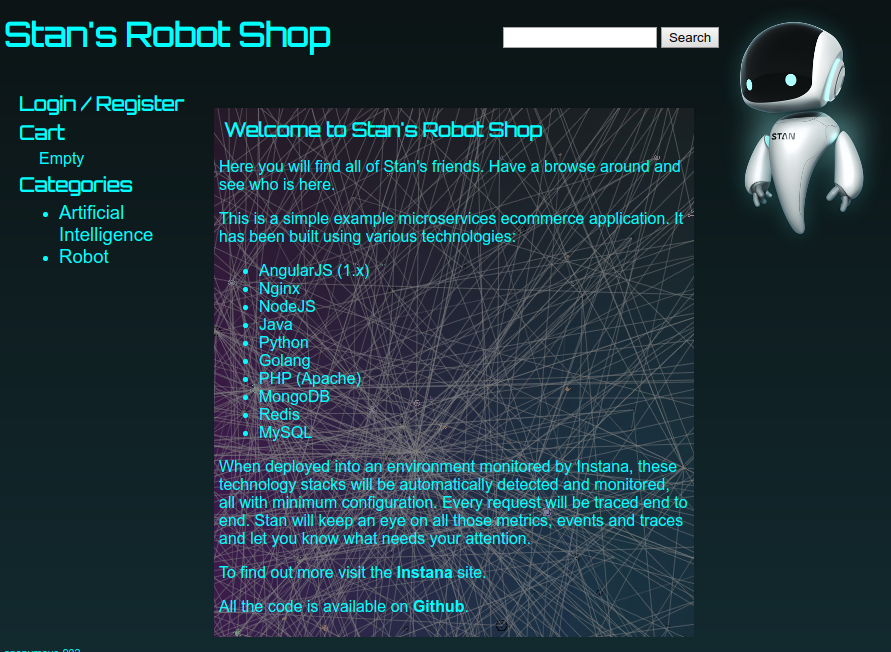

# Introduction

This is an example online shopping app utilizing microservices in K8s with minor modifications from https://github.com/instana/robot-shop.  The modifications were to set registry helm variables and storage.  Note this image by default uses OpenEBS from Gravity 7.0+.  On deployment you will get this front page:




## Building Cluster Image
To construct the Robot Shop Cluster Image with a dependency-free .tar file use this command.  You can then deploy the Robot Shop as a self-contained, truely portable application for your preferred infrastructure. 
```bash
tele build -o robotshop.tar robot-shop-app/resources/app.yaml
```

Further details on installing Gravity Cluster Images is available [here](https://gravitational.com/gravity/docs/installation/). 


## Building Application
In addition to Cluster Images, Gravity supports packaging application helm charts as self-contained application images. The application is then deployable in the same manner as helm charts to Gravity clusters. Further information on application packaging deployment is available [here](https://gravitational.com/gravity/docs/catalog/).
```bash
tele build -o robotshop.tar robot-shop-app/resources/charts/robot-shop
```

The Robot Shop web application runs in this configuration on a nodeport of 30085. 

## Installing
After deploying you should see the following available deployments:  

```bash
$ kubectl get deployments
NAME        READY   UP-TO-DATE   AVAILABLE   AGE
cart        1/1     1            1           15h
catalogue   1/1     1            1           15h
dispatch    1/1     1            1           15h
mongodb     1/1     1            1           15h
mysql       1/1     1            1           15h
payment     1/1     1            2           15h
rabbitmq    1/1     1            1           15h
ratings     1/1     1            1           15h
shipping    1/1     1            1           15h
user        1/1     1            1           15h
web         3/3     3            3           15h
```

# Load generation
Instana's github [repository](https://github.com/instana/robot-shop) contains load generation scripts. Pull down this repository if you'd like to execute load examples. After the application has deployed, change the load-gen/load-gen.sh file's HOST variable to the application deployment  (http://<my ip>:30085).
Switch to the load-gen directory and run `load-gen.sh -n 20` to generate load from 20 clients.  Please explore the load script for other options.
```  
   Name                                                          # reqs      # fails     Avg     Min     Max  |  Median   req/s failures/s
--------------------------------------------------------------------------------------------------------------------------------------------
 GET /                                                              2     0(0.00%)       5       3       7  |       3    0.10    0.00
 GET /api/cart/add/anonymous-906/C3P0/1                             1     0(0.00%)       9       9       9  |       9    0.10    0.00
 GET /api/cart/add/anonymous-906/K9/1                               1     0(0.00%)      17      17      17  |      17    0.10    0.00
 GET /api/cart/add/anonymous-907/K9/1                               1     0(0.00%)       7       7       7  |       7    0.00    0.00
 GET /api/cart/add/anonymous-907/R2D2/1                             1     0(0.00%)       8       8       8  |       8    0.00    0.00
 GET /api/cart/cart/anonymous-906                                   1     0(0.00%)       3       3       3  |       3    0.10    0.00
 GET /api/cart/cart/anonymous-907                                   1     0(0.00%)       3       3       3  |       3    0.00    0.00
 GET /api/cart/update/anonymous-906/K9/2                            1     0(0.00%)       3       3       3  |       3    0.10    0.00
 GET /api/cart/update/anonymous-907/R2D2/2                          1     0(0.00%)       3       3       3  |       3    0.00    0.00
 GET /api/catalogue/categories                                      2     0(0.00%)       5       4       5  |       4    0.10    0.00
 GET /api/catalogue/product/C3P0                                    1     0(0.00%)       5       5       5  |       5    0.10    0.00
 GET /api/catalogue/product/K9                                      2     0(0.00%)       5       5       6  |       5    0.10    0.00
 GET /api/catalogue/product/R2D2                                    1     0(0.00%)       5       5       5  |       5    0.00    0.00
 GET /api/catalogue/products                                        2     0(0.00%)       4       4       4  |       4    0.10    0.00
 POST /api/payment/pay/anonymous-906                                1     0(0.00%)     726     726     726  |     726    0.10    0.00
 POST /api/payment/pay/anonymous-907                                1     0(0.00%)     877     877     877  |     877    0.00    0.00
 GET /api/ratings/api/fetch/C3P0                                    1     0(0.00%)      65      65      65  |      65    0.10    0.00
 GET /api/ratings/api/fetch/K9                                      2     0(0.00%)      18      13      22  |      13    0.10    0.00
 GET /api/ratings/api/fetch/R2D2                                    1     0(0.00%)      20      20      20  |      20    0.00    0.00
 GET /api/shipping/calc/3845147                                     1     0(0.00%)       7       7       7  |       7    0.10    0.00
 GET /api/shipping/calc/4181230                                     1     0(0.00%)       5       5       5  |       5    0.00    0.00
 GET /api/shipping/cities/dk                                        1     0(0.00%)     382     382     382  |     382    0.10    0.00
 GET /api/shipping/cities/hu                                        1     0(0.00%)     551     551     551  |     551    0.00    0.00
 GET /api/shipping/codes                                            2     0(0.00%)       8       5      10  |       5    0.10    0.00
 POST /api/shipping/confirm/anonymous-906                           1     0(0.00%)     966     966     966  |     966    0.10    0.00
 POST /api/shipping/confirm/anonymous-907                           1     0(0.00%)       9       9       9  |       9    0.00    0.00
 POST /api/user/login                                               1     0(0.00%)       6       6       6  |       6    0.10    0.00
 GET /api/user/uniqueid                                             2     0(0.00%)       5       5       5  |       5    0.10    0.00
--------------------------------------------------------------------------------------------------------------------------------------------
 Aggregated                                                        35     0(0.00%)     108       3     966  |       6    1.80    0.00
```
